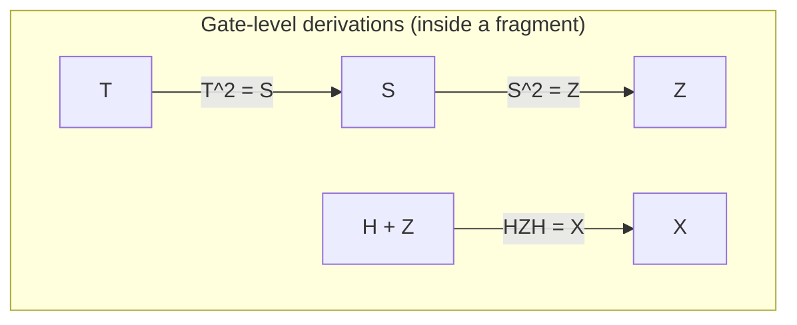
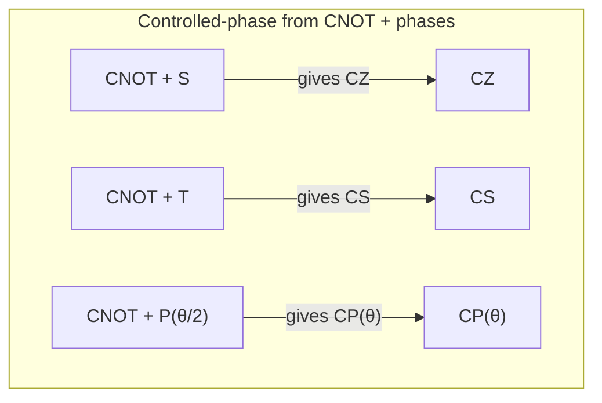
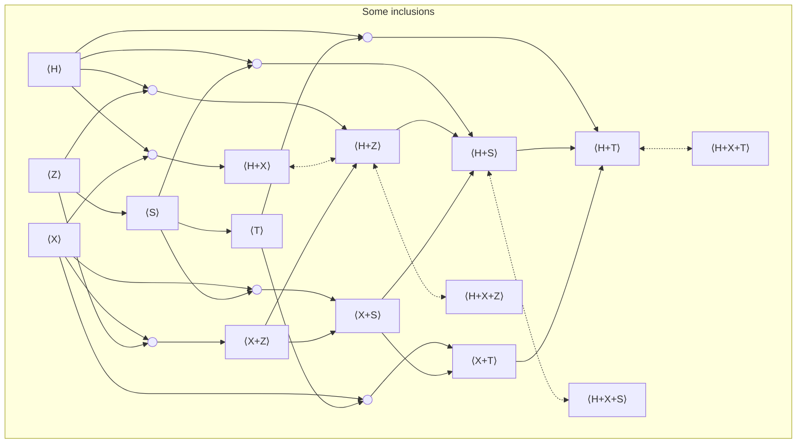

The real plot of quantum computing is not just that amplitudes can be complex. It is that those complex angles - those **phases** - can sit there invisibly for a while, and then a later gate can turn them into something you can actually see in the output statistics. A lot of quantum circuit theory is really about keeping track of where phase lives, how it moves, and which gate sets let you control it.

This page is an atlas of **circuit fragments**. Fix a set of allowed gates $G$, and ask for everything you can build by wiring those gates together on any number of qubits. That "everything you can build" is the fragment generated by $G$. But I want to get to the atlas in the most natural way I know: first understand phase, then understand the gates that manipulate it, and only then look at the fragment landscape as a whole.

> [!WARNING] Scope and conventions
>
> Everything here is about **unitary** circuit fragments only: reversible, lossless evolution that preserves total probability. I am not including measurement, discarding / tracing out, resets, or classical control, and I am ignoring hardware connectivity constraints. Those are important, but they belong to different stories.

A single qubit is written
$$
|\psi\rangle=\alpha|0\rangle+\beta|1\rangle,\qquad |\alpha|^2+|\beta|^2=1.
$$
If you measure immediately in the computational basis, you only see $|\alpha|^2$ and $|\beta|^2$. So it is natural to ask: what are the complex phases doing?

The cleanest answer is interference. Start from $|0\rangle$, make an equal superposition with a Hadamard, add a phase to the $|1\rangle$ branch, and then apply another Hadamard:
$$
|0\rangle
\xrightarrow{H}
\frac{|0\rangle+|1\rangle}{\sqrt2}
\xrightarrow{P(\theta)}
\frac{|0\rangle+e^{i\theta}|1\rangle}{\sqrt2}
\xrightarrow{H}
e^{i\theta/2}\!\left(
\cos\frac{\theta}{2}\,|0\rangle
-
i\sin\frac{\theta}{2}\,|1\rangle
\right).
$$
The overall factor $e^{i\theta/2}$ is a **global phase**: it multiplies the whole state and does not affect ordinary measurement statistics. The phase that *does* matter is the **relative phase** between the two branches. After the final Hadamard, that hidden phase has been converted into visible probabilities:
$$
\Pr(0)=\cos^2(\theta/2),\qquad \Pr(1)=\sin^2(\theta/2).
$$
That is phase in quantum computing in one sentence: it can be invisible now and decisive later.

The special case $\theta=\pi$ is already enough to see the point:
$$
|+\rangle=\frac{|0\rangle+|1\rangle}{\sqrt2},\qquad
|-\rangle=\frac{|0\rangle-|1\rangle}{\sqrt2}.
$$
Measured directly in the computational basis, both look like "50/50." But
$$
H|+\rangle=|0\rangle,\qquad H|-\rangle=|1\rangle.
$$
A single minus sign - just a relative phase - becomes a perfectly observable bit after another gate. That is why phase is not decorative. It is the hidden currency that later gates can spend.

With $n$ qubits, the same idea scales up:
$$
|\psi\rangle=\sum_{x\in\{0,1\}^n}\alpha_x|x\rangle,\qquad \sum_x|\alpha_x|^2=1.
$$
Now there is one amplitude for each classical bitstring. Putting systems side by side is the tensor product $\otimes$, so the state space of $n$ qubits is $(\mathbb{C}^2)^{\otimes n}\cong\mathbb{C}^{2^n}$.

Because I sometimes care about exact unitary equality, not just equality up to global phase, it helps to name scalar phases explicitly:
$$
s(\alpha):=e^{i\alpha},\qquad \omega_k:=e^{2\pi i/k}.
$$

A gate, in this article, means a **unitary** transformation $U$, so
$$
U^\dagger U=I.
$$
Once a basis is fixed, applying a gate is just $|\psi\rangle\mapsto U|\psi\rangle$. There are only two ways to build bigger circuits out of smaller ones, and they are the same two ways you use in every circuit model:

- **Sequential composition:** if $C_1$ implements $U_1$ and $C_2$ implements $U_2$, then "do $C_1$ then $C_2$" implements $U_2U_1$.
- **Parallel composition:** if $U_1$ acts on $n$ qubits and $U_2$ on $m$ qubits, then side by side they act as $U_1\otimes U_2$ on $n+m$ qubits.

A compact notation that appears throughout is $U(d)$: the set of all $d\times d$ unitary matrices. Since an $n$-qubit system lives in dimension $2^n$, the fully general $n$-qubit fragment is $U(2^n)$.

The cast of characters is small, but each one plays a very specific role in the story.

The **Hadamard** is the gate that makes phase feel physical. It trades computational-basis information for phase information and back again:
$$
H=\frac{1}{\sqrt{2}}\begin{pmatrix}1&1\\1&-1\end{pmatrix}.
$$

The Pauli gates $X$ and $Z$ are the basic bit and phase flips:
$$
X=\begin{pmatrix}0&1\\1&0\end{pmatrix},\qquad
Z=\begin{pmatrix}1&0\\0&-1\end{pmatrix}.
$$
$X$ swaps $|0\rangle$ and $|1\rangle$; $Z$ leaves $|0\rangle$ alone and flips the sign of $|1\rangle$.

The whole **phase-gate family** is
$$
P(\theta)=\begin{pmatrix}1&0\\0&e^{i\theta}\end{pmatrix}.
$$
It does nothing to the $|0\rangle$ branch and rotates the phase of the $|1\rangle$ branch. The standard named cases are
$$
S:=P(\tfrac{\pi}{2}),\qquad T:=P(\tfrac{\pi}{4}),\qquad Z:=P(\pi).
$$
Useful identities such as
$$
T^2=S,\qquad S^2=Z,\qquad P(\alpha)P(\beta)=P(\alpha+\beta)
$$
are really just different ways of saying that phases add. Some libraries use $R_z(\theta)$ instead of $P(\theta)$; the difference is only a global-phase convention.

Among two-qubit gates, **CNOT** is the workhorse for moving XOR information around:
$$
\mathrm{CNOT}:|a,b\rangle\mapsto |a,\,b\oplus a\rangle,
$$
with matrix
$$
\mathrm{CNOT}=
\begin{pmatrix}
1&0&0&0\\
0&1&0&0\\
0&0&0&1\\
0&0&1&0
\end{pmatrix}.
$$
And the controlled-phase family
$$
CP(\theta)=\mathrm{diag}(1,1,1,e^{i\theta})
$$
attaches a phase only to the joint condition $|11\rangle$. The familiar special cases are
$$
CZ:=CP(\pi),\qquad CS:=CP(\tfrac{\pi}{2}).
$$

Once you see those roles, the idea of a fragment becomes much less abstract. A gate set is just the menu of moves you are allowed to use. The fragment it generates is every circuit you can make from that menu, together with identity wires and wire rearrangements, and closed under sequential and parallel composition. I will write `H+S+CNOT` to mean "the fragment generated by these gates." The `+` signs do not mean addition; they mean "together with."

The LEGO metaphor is the right one: a gate set is your bag of bricks, and a fragment is the class of things you can actually assemble from those bricks.

Why should anyone care about fragments? Because real devices expose a finite menu of calibrated operations. Because fault-tolerant architectures make some gates dramatically cheaper than others - the familiar "Clifford cheap, non-Clifford expensive" pattern. Because some fragments admit efficient classical simulation. And because many fragments come with clean algebraic structure, which is exactly what you want if you are trying to optimize or verify circuits.

There is also a simple mental model that makes the landscape easier to remember:

- CNOT moves **parities** around.
- Diagonal gates like $P(\theta)$ attach **phases**.
- Hadamards convert between "bit information" and "phase information."

From that point of view, several standard fragments stop feeling mysterious.

Some fragments are purely **local**: they only contain one-qubit gates, so they can never create entanglement. Others include an entangling gate such as CNOT or CZ, and the story changes immediately.

If you allow only **CNOT**, you get invertible XOR-linear maps on bitstrings:
$$
x\mapsto Ax \qquad (A\in GL(n,2)).
$$
If you add $X$, you can also translate, so you get affine maps
$$
x\mapsto Ax+b,
$$
which is the group $AGL(n,2)$.

If you keep CNOT but start adding diagonal phase gates, you enter the world of **parity-phase** or **phase-polynomial** circuits. The reason is simple: CNOT networks compute XOR parities of the input bits, and the phase gates attach angles conditioned on those parities. This is why fragments like `CNOT+T` or, more generally, `CNOT+P(\theta)` have such a distinctive structure.

If you add $H$ and $S$ to CNOT, you get the **Clifford** or **stabilizer** fragment. This is the classical boundary marked by the Gottesman–Knill theorem and a standard workhorse of fault-tolerant quantum computing. Add a small non-Clifford ingredient such as $T$, and you cross into the familiar **Clifford+T** world: no longer classically tame in the same way, and universal by approximation. If instead you allow a continuous family of phases such as all $P(\theta)$, together with $H$ and an entangling gate, you reach full universality:
$$
U(2^n).
$$

At that point there are really only three questions I want the atlas to answer for each fragment.

First, **expressivity**: what family of unitaries do I actually get?

Second, **reasoning**: do I have a usable equational theory, meaning a sound "law book" of local rewrite rules for proving circuit equivalence?

Third, **canonical shape**: do I have a **normal form**, a deterministic standard form to which every circuit can be rewritten?

A theory is **complete** if every true equality in the fragment is derivable from its rules, and **minimal** if none of those rules is redundant. A normal form is what turns equivalence checking into "normalize both circuits and compare."

So the table below is the point where the friendly conversation becomes a map. Each row fixes a generator set. The **Math. name** column gives the standard algebraic object on $n$ qubits, often up to global phase. The last three columns track what is known about reasoning inside the fragment. I write `☑️ [k]` when the statement is established in reference $[k]$ (or in a standard finite-group presentation), `~ [k]` when it is only known for bounded qubit counts or special cases, and `?` when the best clean reference is not pinned down here.

> [!WARNING]
> This is deliberately atlas-like: dense, and mixing circuit language with group language. If you are reading casually, it is completely fine to treat the first three columns as the main event and come back to completeness, minimality, and normal forms only when you actually need them.

## The atlas

| Generators | Math. name | Alternative name | Complete | Minimal | Normal Form |
| --- | --- | --- | --- | --- | --- |
| $\omega_k$ | $C_k$ | Discrete global phases | ☑️ [1] | ☑️ [1] | ☑️ [1] |
| $s(\alpha)$ | $U(1)$ | All global phases | ☑️ [2] | ☑️ [2] | ☑️ [2] |
| $X$ | $C_2^{\,n}$ | Local Pauli-$X$ (bit flips) | ☑️ [1] | ☑️ [1] | ☑️ [1] |
| $Z$ | $C_2^{\,n}$ | Local Pauli-$Z$ | ☑️ [1] | ☑️ [1] | ☑️ [1] |
| $S$ | $C_4^{\,n}$ | Local phase ($S$) gates | ☑️ [1] | ☑️ [1] | ☑️ [1] |
| $T$ | $C_8^{\,n}$ | Local $T$ / $\pi/8$ gates | ☑️ [1] | ☑️ [1] | ☑️ [1] |
| $P(\theta)$ | $(U(1))^{\,n}$ | Local $Z$-rotations | ☑️ [2] | ☑️ [2] | ☑️ [2] |
| $H+Z$ | $D_4^{\times n}$ | Local real Clifford (no entangling) | ☑️ [5] | ☑️ [16] | ☑️ [5] |
| $H+S$ | $\mathcal{C}_1^{\times n}$ | Local Clifford (no entangling) | ☑️ [4] | ☑️ [16] | ☑️ [4] |
| $H+T$ | $\mathrm{Clifford{+}T}_1^{\times n}$ | Local Clifford+T (no entangling) | ☑️ [6] | ☑️ [16] | ☑️ [11] |
| $H+P(\theta)$ | $\mathrm{U}(2)^{\times n}$ | Local unitaries ($\mathrm{LU}$) | ☑️ [9] | ☑️ [9] | ☑️ [9] |
| $X+Z$ | $(C_2)^{2n}$ | Projective Pauli (Paulis mod global phase) | ☑️ [20] | ☑️ [20] | ☑️ [20] |
| $X+Z+i$ | $\mathcal{P}_n$ | Pauli group ($n$ qubits) | ☑️ [15] | ☑️ [15] | ☑️ [21] |
| $X+S$ | $D_4^{\times n}$ | Local dihedral (order 8) | ☑️ [3] | ☑️ [3] | ☑️ [3] |
| $X+T$ | $D_8^{\times n}$ | Local dihedral (order 16) | ☑️ [3] | ☑️ [3] | ☑️ [3] |
| $X+P(\pi/2^k)$ | $D_{2^{k+1}}^{\times n}$ | Local dihedral (2-power) | ☑️ [3] | ☑️ [3] | ☑️ [3] |
| $X+P(\theta)$ | $\big((U(1))^{2}\rtimes C_2\big)^{\times n}$ | Local monomial unitaries | ? | ? | ? |
| $\mathrm{CZ}$ | $\mathbb{Z}_2^{\binom{n}{2}}$ | Graphs | ? | ? | ? |
| $\mathrm{CNOT}$ | $\mathrm{GL}(n,2)$ | Linear reversible | ☑️ [12] | ? | ☑️ [12] |
| $\mathrm{CNOT}+H$ | ? | CNOT+H circuits | ? | ? | ? |
| $\mathrm{CNOT}+X$ | $\mathrm{AGL}(n,2)$ | Affine reversible | ☑️ [14] | ? | ☑️ [14] |
| $\mathrm{CNOT}+Z$ | $C_2^n \rtimes GL(n,2)$ | CNOT+Z circuits | ~ [8] | ? | ~ [8] |
| $\mathrm{CNOT}+S$ | ? | CNOT+S circuits | ~ [8] | ? | ~ [8] |
| $\mathrm{CNOT}+T$ | ? | CNOT+T circuits | ☑️ [8] | ? | ☑️ [8] |
| $\mathrm{CNOT}+P(\theta)$ | $(U(1))^{2^n} \rtimes GL(n,2)$ | Phase-polynomial circuits | ? | ? | ? |
| $\mathrm{CNOT}+H+Z$ | $\mathrm{Real\,Clifford}_n$ | Real stabilizer circuits | ☑️ [5] | ☑️ [16] | ☑️ [5] |
| $\mathrm{CNOT}+H+Z+\mathrm{CH}$ | ? | Real stabilizer+CH circuits | ☑️ [22] | ? | ? |
| $\mathrm{CNOT}+H+S$ | $\mathcal{C}_n$ | Stabilizer / Clifford circuits | ☑️ [4] | ☑️ [16] | ☑️ [4] |
| $\mathrm{CNOT}+H+T$ | $\mathrm{Clifford{+}T}_n$ | Clifford+T | ~ [6] | ~ [16] | ~ [6] |
| $\mathrm{CNOT}+H+P(\theta)$ | $\mathrm{U}(2^n)$ | Universal | ☑️ [9] | ☑️ [9] | ? |
| $\mathrm{Ctrl}+H+s(\theta)$ | $\mathrm{U}(2^n)$ | Universal with native control | ☑️ [27] | ? | ? |
| $\mathrm{CNOT}+X+Z$ | $(C_2)^{2n} \rtimes \mathrm{GL}(n,2)$ | CNOT+Pauli (mod phase) | ~ [8] | ~ [16] | ~ [8] |
| $\mathrm{CNOT}+X+Z+i$ | $\mathcal{P}_n \rtimes \mathrm{GL}(n,2)$ | CNOT+Pauli | ? | ? | ? |
| $\mathrm{CNOT}+X+S$ | ? | CNOT-dihedral circuits | ~ [8] | ~ [16] | ~ [8] |
| $\mathrm{CNOT}+X+T$ | ? | CNOT-dihedral circuits | ☑️ [8] | ☑️ [16] | ☑️ [8] |
| $\mathrm{CNOT}+X+P(\pi/2^k)$ | ? | Generalised CNOT-dihedral | ~ [8] | ~ [16] | ~ [8] |
| $\mathrm{CNOT}+X+P(\theta)$ | $(U(1))^{2^n}\rtimes AGL(n,2)$ | Affine phase-polynomial | ? | ? | ? |
| $\mathrm{CCZ}+\mathrm{CNOT}+H+S$ | ? | Clifford+Toffoli | ? | ? | ? |
| $\mathrm{CS}+H+S$ | $\mathrm{Clifford{+}CS}_n$ | Clifford+CS | ~ [7] | ~ [16] | ~ [7] |
| $\mathrm{CZ}+S$ | $\mathrm{Clifford}_n^{\mathrm{diag}}$ | Diagonal Clifford | ? | ? | ☑️ [12] |
| $\mathrm{CNOT}\!\downarrow+\mathrm{CZ}+X+S$ | $\mathcal{B}_n$ | Borel subgroup | ? | ? | ? |
| $\mathrm{CP}(\theta)+P(\theta)$ | ? | Diagonal commuting phase gates | ? | ? | ? |
| $\mathrm{CNOT}+X+\mathrm{CCNOT}$ | $A_{2^n}$ | Reversible Boolean functions | ? | ? | ? |
| $\mathrm{CCNOT}+H$ | ? | Toffoli+H circuits | ~ [25] | ? | ? |
| $\mathrm{SWAP}$ | $\mathcal{S}_n$ | Symmetric group | ☑️ [13] | ? | ☑️ [24] |
| $\mathrm{SWAP}+H$ | $C_2^n \rtimes S_n$ | Weyl group | ? | ? | ? |
| $\mathrm{SWAP}+\mathrm{CZ}$ | ? | SWAP+CZ circuits | ? | ? | ☑️ [12] |

### Qudits (non-qubit rows)

| Dim. | Generators | Math. name | Alternative name | Complete | Minimal | Normal Form |
| --- | --- | --- | --- | --- | --- | --- |
| $p$ | $\mathrm{SUM}+M(x)$ | ? | Linear reversible circuits | ☑️ [24] | ? | ☑️ [24] |
| $p$ | $\mathrm{SUM}+M(x)+X$ | ? | Affine reversible circuits | ☑️ [26] | ? | ☑️ [26] |
| $p$ | $\mathrm{SUM}+M(x)+X+Z$ | ? | Affine+Z circuits | ☑️ [26] | ? | ☑️ [26] |
| $p$ | $\mathrm{SUM}+M(x)+X+S$ | ? | Affine+S circuits | ☑️ [26] | ? | ☑️ [26] |
| $p$ | $\mathrm{SUM}+M(x)+X+T$ | ? | Affine+T circuits | ☑️ [26] | ? | ☑️ [26] |
| $3$ | $H+S+\mathrm{SUM}$ | ? | Qutrit stabilizer | ☑️ [10] | ~ [16] | ☑️ [10] |
| $d$ | $H+S+\mathrm{SUM}$ | ? | Qudit stabilizer | ? | ? | ? |
| $3$ | $H+S+T+\mathrm{SUM}$ | ? | Qutrit Clifford+T | ? | ? | ☑️ [17] |
| $d$ | $H+S+T+\mathrm{SUM}$ | ? | Qudit Clifford+T | ? | ? | ☑️ [18] |
| $3$ | $H+S+R+\mathrm{SUM}$ | ? | Qutrit Clifford+R / Metaplectic | ? | ? | ? |
| $3$ | $X+\mathrm{SUM}+CCX+H+T_k$ | Clifford-cyclotomic (degree $3^k$) | Qutrit Toffoli+Hadamard $(k=1)$, Clifford+$T_k$ $(k>1)$ | ? | ? | ~ [19] |
| $d$ | $\mathrm{Ctrl}+H^{ij}+s(\theta)$ | ? | Qudit universal with native control | ☑️ [23] | ? | ? |

> [!INFO]
> This table is a navigation aid, not a full survey. Some rows are on very solid ground; some still require a fair amount of reference-hunting.

## A few little derivations explain many inclusions

A nice thing about fragment tables is that a lot of them are not independent facts. Once you know a few small identities, many of the inclusion arrows become obvious.

**Powers and conjugation.**  
If you can repeat a gate or conjugate one gate by another, you often get new generators "for free." For example, $S$ gives $Z$ because $Z=S^2$, $T$ gives $S$ because $S=T^2$, and $H$ together with $Z$ gives $X$ via $X=HZH$.

**Non-commuting one-qubit gates can generate scalar phase.**  
If you track exact unitaries, not just equivalence up to global phase, then non-commutation can produce phases all by itself. For instance, $X+P(2\pi/k)$ implies $\omega_k$, because
$$
P\!\left(\tfrac{2\pi}{k}\right) X P\!\left(\tfrac{2\pi}{k}\right) X
=
\mathrm{diag}(\omega_k,\omega_k)
=
\omega_k I.
$$
In particular, $H+S$ implies $\omega_8$, because
$$
(HS)^3=\omega_8 I.
$$

**CNOT plus single-qubit phase gives controlled phase.**  
A very useful identity is
$$
CP(\theta) = (P(\tfrac{\theta}{2})\otimes P(\tfrac{\theta}{2}))\mathrm{CNOT}(I\otimes P(-\tfrac{\theta}{2}))\mathrm{CNOT}.
$$
So `CNOT+S` gives $CZ$ by taking $\theta=\pi$, `CNOT+T` gives $CS$ by taking $\theta=\pi/2$, and more generally `CNOT+P(\theta/2)` gives `CP(\theta)`.

**Hadamards trade CNOT for CZ.**  
The identity
$$
(I\otimes H)\,\mathrm{CNOT}\,(I\otimes H)=CZ
$$
says that CNOT and CZ are the same entangling idea, just viewed in different bases. So `CNOT+H` gives `CZ`, and `CZ+H` gives `CNOT`.

If you wanted the whole page reduced to one sentence, it would be this: a quantum fragment is a statement about which kinds of **bit moves**, **parity moves**, and **phase moves** you are allowed to combine. Once you see that, the table is not a pile of unrelated gate sets anymore. It is a map of different ways quantum circuits can organize information.

## References

[1] https://proofwiki.org/wiki/Cyclic_Group/Group_Presentation

[2] https://en.wikipedia.org/wiki/Circle_group#:~:text=integer%20multiples%20of%20%E2%81%A0Image%3A%20,Z%7D%20%7D%E2%81%A0

[3] https://proofwiki.org/wiki/Dihedral_Group/Group_Presentation

[4] https://arxiv.org/abs/1310.6813

[5] https://arxiv.org/abs/2109.05655

[6] https://arxiv.org/abs/2204.02217

[7] https://arxiv.org/abs/2306.08530

[8] https://arxiv.org/abs/1701.00140

[9] https://arxiv.org/abs/2311.07476

[10] https://arxiv.org/abs/2508.14670

[11] https://arxiv.org/abs/1312.6584

[12] https://arxiv.org/abs/2012.09224

[13] https://www.math.auckland.ac.nz/~conder/preprints/SymGpPresentations.pdf

[14] https://www.sciencedirect.com/science/article/pii/S0022404903000690

[15] https://groupprops.subwiki.org/wiki/Central_product_of_D8_and_Z4

[16] https://hal.science/hal-05502157v1/file/main.pdf

[17] https://arxiv.org/abs/1803.03228

[18] https://arxiv.org/abs/2011.07970

[19] https://arxiv.org/abs/2405.08136

[20] https://en.wikipedia.org/wiki/Klein_four-group

[21] https://en.wikipedia.org/wiki/Pauli_group

[22] https://hal.science/hal-05487235

[23] https://hal.science/view/index/docid/5503323

[24] https://www.i2m.univ-amu.fr/perso/yves.lafont/pub/circuits.pdf

[25] https://www.cs.sfu.ca/~meamy/Papers/cox.pdf

[26] https://arxiv.org/abs/2603.06466

[27] https://arxiv.org/abs/2508.21756