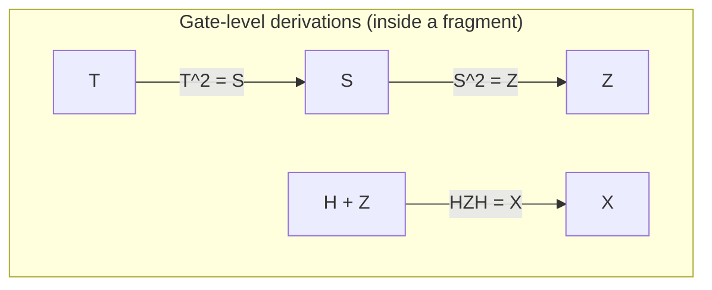
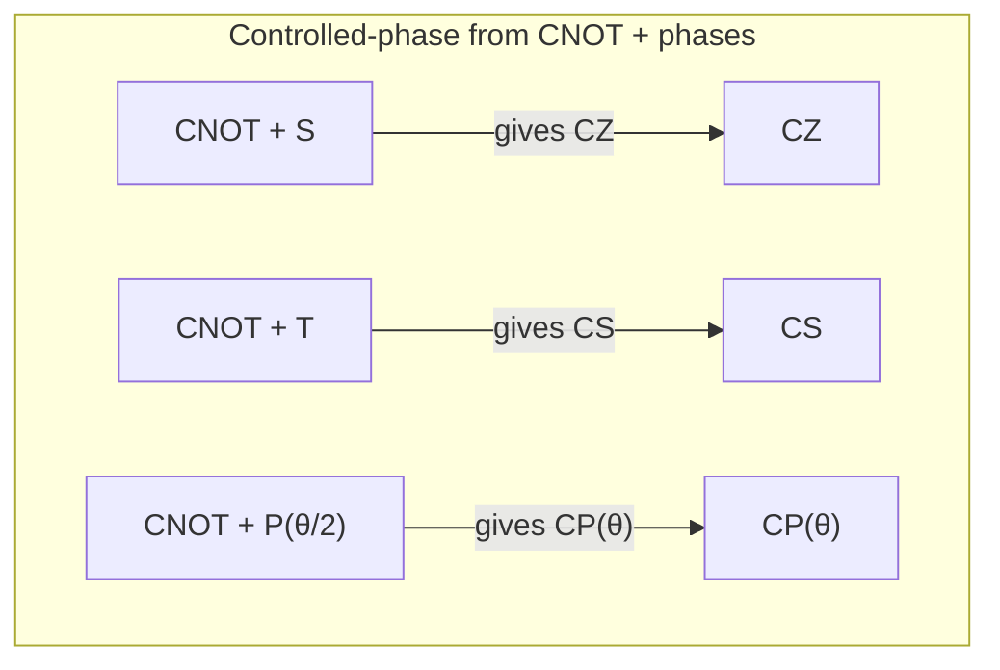
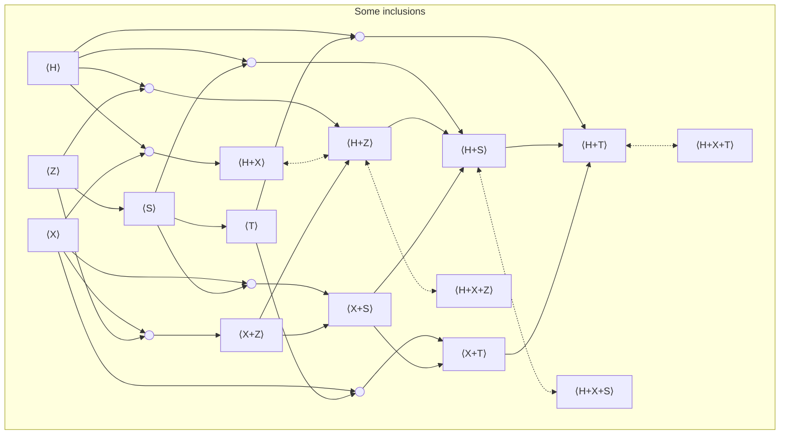

import Callout from "../../components/Callout.astro";

This page is a compact **atlas of "circuit fragments"**.

A good mental picture is **LEGO**:

- A **gate set** is your *bag of LEGO bricks* (the gates you’re allowed to use).
- A **fragment** is *everything you can build* by snapping those bricks together into circuits.

The goal of the atlas table near the end is to answer, for many common gate sets:

- *What family of unitaries do you get?*
- *Do we have a nice "law book" (rewrite rules) to prove two circuits are equivalent?*
- *Do we have a canonical "normal form" shape for circuits in that fragment?*

> [!WARNING] Scope and conventions
>
> - This atlas is about **unitary** circuit fragments only.  
>   Think: **reversible, lossless evolution** — like a rotation in a high‑dimensional space that preserves total probability.
> - We do **not** include measurement, discarding/tracing out, resetting qubits, or classical control.
> - Gates may be applied to any qubits; we ignore hardware connectivity constraints (routing is a separate compilation layer).

---

## A quick roadmap for non-specialists

If you don’t want to wade through the math, here are the only ideas you need to read the page:

1. A quantum state is like a **probability wave** over classical bitstrings.
2. A unitary gate is a **reversible "mixing"** of those waves that preserves total probability.
3. A circuit fragment is the set of all such reversible mixings you can build when you limit which basic gates you’re allowed to use.

Everything else is just notation for making those ideas precise.

---

## What is a quantum circuit, intuitively?

A **quantum circuit** is a recipe made of small reversible steps (**gates**) applied to wires (**qubits**).

- Each **wire** carries a qubit.
- Each **gate** is a tiny reversible operation (on 1, 2, or a few qubits).
- A **circuit** is what you get when you chain these gates.

Two ways to "snap circuits together" matter constantly:

1. **Sequential composition**: do circuit A, then circuit B on the same wires.
2. **Parallel composition**: do circuit A on some wires and circuit B on different wires at the same time.

> [!TIP] The "physics" metaphor
> - Sequential composition is like *doing two moves in a row*.
> - Parallel composition is like *doing two moves on two independent subsystems side-by-side*.

Later we’ll connect those to matrix multiplication and tensor products, but you don’t need to think "matrices" to follow the story.

---

## What is a qubit, in plain language?

A classical bit is either `0` or `1`.  
A **qubit** is more like a **dial** that can point in a continuum of ways, but when you measure it you only ever see `0` or `1`.

In the simplest ("pure state") model, a qubit state is written
$$
|\psi\rangle = \alpha |0\rangle + \beta |1\rangle.
$$

Here’s the intuition:

- $|0\rangle$ and $|1\rangle$ are the two basic outcomes ("north" and "south" on the dial).
- $\alpha$ and $\beta$ are **amplitudes** (complex numbers).
- The measurement probabilities come from **squared magnitudes**:
  - $\Pr(0)=|\alpha|^2$
  - $\Pr(1)=|\beta|^2$
- "Total probability is 1" becomes:
$$
|\alpha|^2 + |\beta|^2 = 1.
$$

> [!INFO] What does complex amplitude really mean?
> 
> A complex number is $a+ib$ with $i^2=-1$.  
> You can think of a complex amplitude as having:
> - a **size** (how much weight it carries), and
> - a **phase** (a direction on a circle).
>
> Interference effects come from phases lining up or cancelling out.

### The computational basis

The standard "labels" for measurement outcomes are:
$$
|0\rangle = \begin{pmatrix}1\\0\end{pmatrix},\qquad
|1\rangle = \begin{pmatrix}0\\1\end{pmatrix}.
$$
This is just a convenient coordinate system.

---

## Many qubits: one state, many classical strings

With $n$ classical bits, there are $2^n$ bitstrings.  
With $n$ qubits, the state can assign an amplitude to **each** bitstring at once:
$$
|\psi\rangle = \sum_{x\in\{0,1\}^n} \alpha_x |x\rangle,
\qquad \sum_x |\alpha_x|^2 = 1.
$$

> [!INFO] The "spreadsheet" metaphor
> Imagine a spreadsheet with $2^n$ rows, one row per bitstring $x$.  
> A quantum state is like filling that sheet with complex amplitudes $\alpha_x$, constrained so that the squared magnitudes sum to 1.

### Tensor product $\otimes$: "put systems together"

Mathematically, combining systems uses the **tensor product** $\otimes$. Conceptually it means:

> "Take all combinations of the possibilities of system A with the possibilities of system B."

For two qubits:
$$
\mathbb{C}^2\otimes \mathbb{C}^2 \cong \mathbb{C}^4,
$$
so there are 4 basis states:
$$
|00\rangle,\;|01\rangle,\;|10\rangle,\;|11\rangle.
$$

More generally:
$$
(\mathbb{C}^2)^{\otimes n}\cong \mathbb{C}^{2^n}.
$$

> [!TIP] 
> 
> Why people write $(\mathbb{C}^2)^{\otimes n}$ ?
> It’s a reminder that an $n$-qubit state space is built by repeatedly "stacking together" $n$ 2‑dimensional systems.

---

## What is a unitary gate?

A **gate** (in this article) means a **unitary** operation.

Intuition first:

- A unitary gate is a reversible transformation that **never breaks probability**.
- It can "redistribute" amplitudes and change phases, but it always keeps
  $\sum_x |\alpha_x|^2 = 1$.

Mathematically, once you choose a basis, a gate is a matrix $U$ and applying it is:
$$
|\psi\rangle \mapsto U|\psi\rangle.
$$
"Unitary" means:
$$
U^\dagger U = I,
$$
where $U^\dagger$ is the conjugate transpose and $I$ is the identity matrix.

> [!TIP] The rotation metaphor
>
> In ordinary 3D geometry, rotations preserve lengths.  
> A unitary is the complex, high‑dimensional analog: it preserves vector length (and that’s why probabilities still add up to 1).

---

## How circuits compose (the minimal math you’ll see)

If circuit $C_1$ implements unitary $U_1$ and $C_2$ implements $U_2$, then:

### Sequential composition: "do one after another"
$$
C_2\circ C_1 \quad\text{implements}\quad U_2U_1.
$$
(First applied is on the right — same convention as function composition.)

### Parallel composition: "do them side-by-side"
If $C_1$ is on $n$ qubits and $C_2$ on $m$ qubits, then side-by-side means:
$$
U_1\otimes U_2 \in U(2^{n+m}).
$$

> [!INFO] What is U(d)?
>
> $U(d)$ is just shorthand for "the set of all $d\times d$ unitary matrices."  
> You can read it as: "all reversible, probability‑preserving transformations of a $d$-dimensional quantum state."

---

## Gate sets and fragments

Now we can define the key object of this page.

### Gate set = allowed "primitives"
A **gate set** is the list of basic gates you allow yourself, like
$$
G = \{H,S,\mathrm{CNOT}\}.
$$

### Fragment = everything you can build from them
The **fragment generated by $G$** is:

> the set of all circuits you can build using gates in $G$, plus identity wires, plus "wiring moves" (like swapping wires), closed under sequential and parallel composition.

> [!INFO] The "closure" idea, in everyday language
> - You may reuse gates any number of times.
> - You may apply them on any wires.
> - You may chain them or stack them.

---

## Notation: what does `H+S+CNOT` mean?

I’ll write `H+S+CNOT`
to mean:
 "the fragment generated by these gates."

Formally, you can think of it as:
$$
\langle H, S, \mathrm{CNOT} \rangle.
$$

> [!WARNING]
> The `+` is **not addition**.  
> Read it as: **"together with"** or **"generated by."**

---

## Why do fragments matter?

Restricting gates can sound like you’re "making the computer weaker". In practice, fragments are where quantum computing becomes *analyzable*.

### 1) Real hardware is fragment-shaped (exactly)
Real devices implement a limited menu of calibrated operations.

So fragments separate:
- **exact expressibility** (what you can do exactly with native gates), from
- **approximation / synthesis** (how you compile an ideal gate into what hardware supports).

### 2) Fault-tolerance makes some gates cheap and others expensive
In error-corrected architectures, gate costs can be wildly uneven. A common pattern is:

- **Clifford** operations are "cheap"
- **non‑Clifford** gates (often $T$) are "expensive"

That is why "Clifford+T" is such a central practical library.

> [!TIP] Common cost counters you’ll hear
> - **T-count**: how many $T$ gates you used.
> - **T-depth**: how many parallel layers of $T$ you need.
> - number of magic states, etc.

### 3) Some fragments are efficiently classically simulable
Certain fragments have special structure that makes them simulable in polynomial time (for large families of circuits). Classic example:

- stabilizer / Clifford circuits (Gottesman–Knill)

What makes fragments interesting is that **tiny extensions can jump you to universality**, e.g.:

- "Clifford + almost any non-Clifford single-qubit gate" often becomes universal (for approximation).
- "Clifford + T" is the canonical fault-tolerant universal-by-approximation fragment.

### 4) Fragments often come with clean algebra
Once you recognize the algebra under the hood, you often get "free" tools:

- invariants (things that never change),
- normal forms (canonical shapes),
- efficient equivalence checking,
- specialized synthesis / optimization algorithms.

Examples (intuition-focused):

- `CNOT` alone behaves like doing **XOR-linear transformations** on bitstrings.
- `CNOT+X` lets you also add constant bit flips (**affine** transformations).
- `CNOT` plus diagonal phase gates often yields **phase-polynomial** structure (phases conditioned on parities).

---

## The gates we will use

This section is a small "dictionary": each gate is listed with an intuitive meaning, plus the standard matrix definition (for readers who want it).

Throughout we use the computational basis $\{|0\rangle,|1\rangle\}$.

### Global phase (optional but sometimes important)

A **global phase** multiplies the entire state vector by a unit‑magnitude complex number.

- Physically, global phase is invisible to standard measurement statistics.
- Mathematically, it matters if you care about exact matrix equality rather than "equal up to a global phase".

Two common notations:

- Continuous phase:
  $$
  s(\alpha) := e^{i\alpha}.
  $$
- Discrete root of unity:
  $$
  \omega_k := e^{2\pi i/k}.
  $$

> [!TIP]
> If you work **up to global phase** (identify $U$ and $e^{i\alpha}U$), you usually omit these scalars from generators.

---

### Single-qubit gates

#### Hadamard $H$

**Concept:** turns "definitely 0/1" into an equal superposition, and swaps the roles of "bit value" vs "phase information".

$$
H = \frac{1}{\sqrt 2}\begin{pmatrix}1&1\\1&-1\end{pmatrix}.
$$

#### Pauli $X$ and $Z$

**Concept:**
- $X$: flips $|0\rangle \leftrightarrow |1\rangle$ (a classical NOT).
- $Z$: leaves $|0\rangle$ alone and flips the *sign* of $|1\rangle$ (a phase flip).

$$
X = \begin{pmatrix}0&1\\1&0\end{pmatrix},\quad
Z = \begin{pmatrix}1&0\\0&-1\end{pmatrix}.
$$

#### Phase gate family $P(\theta)$

**Concept:** "if the qubit is $|1\rangle$, rotate its complex phase by $\theta$; if it’s $|0\rangle$, do nothing."

$$
P(\theta) = \begin{pmatrix}1&0\\0&e^{i\theta}\end{pmatrix}.
$$

Special cases:
$$
S := P(\tfrac{\pi}{2})=\begin{pmatrix}1&0\\0&i\end{pmatrix},\quad
T := P(\tfrac{\pi}{4})=\begin{pmatrix}1&0\\0&e^{i\pi/4}\end{pmatrix},\quad
Z := P(\pi).
$$

> [!TIP] Useful "power" identities
> - $T^2=S$
> - $S^2=Z$
> - $T^4=Z$
> - $P(\alpha)P(\beta)=P(\alpha+\beta)$ and $P(\theta+2\pi)=P(\theta)$

> [!INFO]
> Some libraries use $R_z(\theta)$ instead of $P(\theta)$.  
> They differ only by a global phase convention, but that can matter if you track exact equalities.

---

### Two-qubit controlled gates

#### CNOT

**Concept:** a classical XOR controlled by one bit, but applied coherently to superpositions.

$$
\mathrm{CNOT}:|a,b\rangle\mapsto |a,\, b\oplus a\rangle.
$$
Here $\oplus$ is XOR (addition mod 2).

Matrix:
$$
\mathrm{CNOT}=
\begin{pmatrix}
1&0&0&0\\
0&1&0&0\\
0&0&0&1\\
0&0&1&0
\end{pmatrix}.
$$

#### Controlled phase $CP(\theta)$

**Concept:** "only when both qubits are 1, add a phase."

$$
CP(\theta)=\mathrm{diag}(1,1,1,e^{i\theta}).
$$

Special cases:
$$
CZ := CP(\pi)=\mathrm{diag}(1,1,1,-1),\quad
CS := CP(\tfrac{\pi}{2})=\mathrm{diag}(1,1,1,i).
$$

---

## A "map" of the fragment landscape

Before the atlas table, here’s the big picture in human terms.

### Local vs entangling fragments

- **Local fragments** contain only 1-qubit gates.  
  They can never create entanglement between wires.  
  Example: `H+S` applied independently on each qubit.

- **Entangling fragments** include at least one genuinely entangling 2‑qubit gate (CNOT, CZ, …).  
  Example: `CNOT+H+S` (the full Clifford fragment).

### The "classical reversible" region

If your allowed gates only ever **permute computational basis states** (no superpositions), then you’re doing reversible classical computing inside the quantum circuit model.

- `CNOT` gives invertible XOR-linear maps $x\mapsto Ax$ over $\mathbb{F}_2$ (bits with XOR arithmetic).
- `CNOT+X` gives affine maps $x\mapsto Ax+b$ (linear + a constant shift).

> [!INFO] Group names you might see
> - $GL(n,2)$: invertible $n\times n$ matrices over $\mathbb{F}_2$ (linear reversible maps).
> - $AGL(n,2)$: affine version (linear + translations).

### Stabilizer / Clifford region

Generated by `CNOT+H+S`.

> [!IMPORTANT]
> This is the classic boundary of efficient stabilizer simulation (Gottesman–Knill) and a cornerstone of fault-tolerant design.

### "Just beyond Clifford": structured phases

Practical compilation often lives in fragments like:

- `CNOT+T`, `CNOT+X+T`
- `CNOT+P(\theta)` (phase-polynomial / parity-phase circuits)

Intuition:
- CNOT networks compute parities (XORs).
- Phase gates attach phases conditioned on those parities.
- Put together, you get a lot of expressive power **with structure** you can optimize.

### Universal fragments

If you allow a continuous family of single-qubit rotations (like all $P(\theta)$) plus an entangling gate like CNOT (and usually $H$), you can generate all of $U(2^n)$ (universality).

If you restrict to a discrete non‑Clifford gate like $T$, you still get the standard universal-by-approximation fault-tolerant library (Clifford+T).

---

## Reasoning inside a fragment: equations and normal forms

The atlas table doesn’t just say "what you can compute" — it also tracks what is known about **how to reason** about circuits inside that fragment.

### Equational theory = a "law book" for rewrites

An **equational theory** is a set of rewrite rules (equations between small circuits) that you’re allowed to apply.

Think:
- replace a subcircuit by a different-looking subcircuit that implements the same unitary.

We care about:

- **Soundness**: every rule is actually correct (never changes the implemented unitary).
- **Completeness**: every true equality inside the fragment can be proved using the rules.
- **Minimality**: none of the listed rules is redundant.

### Normal form = a canonical circuit shape

A **normal form** is a deterministic way to rewrite any circuit in the fragment into a standard shape.

The dream scenario:
- every semantic element has exactly one normal form,
- so equivalence checking becomes: "rewrite both, then compare textually."

---

## The atlas: how to read the fragment table

> [!TIP] Table columns
> - **Generators**: the gate set you start from.
> - **Math. name**: a standard algebraic label for what you get on $n$ qubits (often a group, sometimes "up to global phase").
> - **Alternative name**: common compiler / circuit terminology.
> - **Complete**: do we know a complete equational theory for that fragment?
> - **Minimal**: is that theory proven minimal?
> - **Normal Form**: do we have a deterministic normal form?

> [!INFO]
> - `☑️ [k]` = established in reference `[k]` (or standard finite-group presentation).
> - `~ [k]` = only for bounded qubit counts / special cases / or the idea is present but not stated cleanly.
> - `?` = best reference not pinned down here.

> [!WARNING]
> The table below is intentionally "atlas-like": it’s dense, and it mixes circuit language with group language.
> If you’re reading this as a curious non-specialist, feel free to:
> - skim the **Generators** and **Alternative name** columns,
> - ignore the rest until you need it.

---

## The atlas table (qubits)

| Generators | Math. name  | Alternative name | Complete | Minimal | Normal Form |
| --- | --- | --- | --- | --- | --- |
| $\omega_k$ | $C_k$ | Discrete global phases | ☑️ [1] | ☑️ [1] | ☑️ [1] |
| $s(\alpha)$ | $U(1)$ | All global phases |  ☑️ [2] | ☑️ [2] | ☑️ [2] |
| $X$ | $C_2^{\,n}$ | Local Pauli‑$X$ (bit flips) | ☑️ [1] | ☑️ [1] | ☑️ [1] |
| $Z$ | $C_2^{\,n}$ | Local Pauli‑$Z$ | ☑️ [1] | ☑️ [1] | ☑️ [1] |
| $S$ | $C_4^{\,n}$ | Local phase ($S$) gates | ☑️ [1] | ☑️ [1] | ☑️ [1] |
| T | $C_8^{\,n}$ | Local T / $\pi/8$ gates | ☑️ [1] | ☑️ [1] | ☑️ [1] |
| $P(\theta)$ | $(U(1))^{\,n}$ | Local $Z$‑rotations |  ☑️ [2] | ☑️ [2] | ☑️ [2] |
| $H+Z$ | $D_4^{\times n}$ | Local real Clifford (no entangling) | ☑️ [5] | ☑️ [16] | ☑️ [5] |
| $H+S$ | $\mathcal{C}_1^{\times n}$ | Local Clifford (no entangling) | ☑️ [4] | ☑️ [16] | ☑️ [4] |
| $H+T$ | $\mathrm{Clifford{+}T}_1^{\times n}$ | Local Clifford+T (no entangling) | ☑️ [6] | ☑️ [16] | ☑️ [11] |
| $H+P(\theta)$ | $\mathrm{U}(2)^{\times n}$ | Local unitaries ($\mathrm{LU}$) | ☑️ [9] | ☑️ [9] | ☑️ [9] |
| $X+Z$ | $(C_2)^{2n}$ | Projective Pauli (Paulis mod global phase) | ☑️ [20] | ☑️ [20] | ☑️ [20] |
| $X+Z+i$ | $\mathcal{P}_n$ | Pauli group ($n$ qubits) | ☑️ [15] |☑️ [15] | ☑️ [21] |
| $X+S$  | $D_4^{\times n}$ | Local dihedral (order 8) | ☑️ [3] | ☑️ [3] | ☑️ [3] |
| $X+T$  | $D_8^{\times n}$ | Local dihedral (order 16) | ☑️ [3] | ☑️ [3] | ☑️ [3] |
| $X+P(\pi/2^k)$ | $D_{2^{k+1}}^{\times n}$ | Local dihedral (2‑power) | ☑️ [3] | ☑️ [3] | ☑️ [3] |
| $X+P(\theta)$ | $\big((U(1))^{2}\rtimes C_2\big)^{\times n}$ | Local monomial unitaries | ? | ? | ? |
| $\mathrm{CZ}$ | $\mathbb{Z}_2^{\binom{n}{2}}$ | Graphs | ? | ? | ? |
| $\mathrm{CNOT}$ | $\mathrm{GL}(n,2)$ | Linear reversible | ☑️ [12] | ? | ☑️ [12] |
| $\mathrm{CNOT}+H$ | ? | CNOT+H circuits | ? | ? | ? |
| $\mathrm{CNOT}+X$ | $\mathrm{AGL}(n,2)$ | Affine reversible | ☑️ [14] | ? | ☑️ [14] |
| $\mathrm{CNOT}+Z$ | $C_2^n \rtimes GL(n,2)$ | CNOT+Z circuits| ? | ? | ? |
| $\mathrm{CNOT}+S$ | ? | CNOT+S circuits | ? | ? | ? |
| $\mathrm{CNOT}+T$ | ? | CNOT+T circuits | ? | ? | ? |
| $\mathrm{CNOT}+P(\theta)$ | $(U(1))^{2^n} \rtimes GL(n,2)$ | Phase-polynomial circuits | ? | ? | ? |
| $\mathrm{CNOT}+H+Z$ | $\mathrm{Real\,Clifford}_n$ | Real stabilizer circuits | ☑️ [5] | ☑️ [16] | ☑️ [5] |
| $\mathrm{CNOT}+H+Z+\mathrm{CH}$ | ? | Real stabilizer+CH circuits | ☑️ [22] | ? | ? |
| $\mathrm{CNOT}+H+S$ | $\mathcal{C}_n$ | Stabilizer / Clifford circuits | ☑️ [4] | ☑️ [16] | ☑️ [4] |
| $\mathrm{CNOT}+H+T$ | $\mathrm{Clifford{+}T}_n$ | Clifford+T| ~ [6] | ~ [16] | ~ [6] |
| $\mathrm{CNOT}+H+P(\theta)$ | $\mathrm{U}(2^n)$ | Universal | ☑️ [9] | ☑️ [9] | ? |
| $\mathrm{CNOT}+X+Z$ | $(C_2)^{2n} \rtimes \mathrm{GL}(n,2)$ | CNOT+Pauli (mod phase) | ~ [8] | ~ [16] | ~ [8] |
| $\mathrm{CNOT}+X+Z+i$ | $\mathcal{P}_n \rtimes \mathrm{GL}(n,2)$ | CNOT+Pauli | ? | ? | ? |
| $\mathrm{CNOT}+X+S$ | ? | CNOT-dihedral circuits | ~ [8] | ~ [16] | ~ [8] |
| $\mathrm{CNOT}+X+T$ | ? | CNOT-dihedral circuits | ☑️ [8] | ☑️ [16] | ☑️ [8] |
| $\mathrm{CNOT}+X+P(\pi/2^k)$ | ? | Generalised CNOT-dihedral | ~ [8] | ~ [16] | ~ [8] |
| $\mathrm{CNOT}+X+P(\theta)$ | $(U(1))^{2^n}\rtimes AGL(n,2)$ | Affine phase-polynomial | ? | ? | ? |
| $\mathrm{CCZ}+\mathrm{CNOT}+H+S$ | ? | Clifford+Toffoli | ? | ? | ? |
| $\mathrm{CS}+H+S$ | $\mathrm{Clifford{+}CS}_n$ | Clifford+CS | ~ [7] | ~ [16] | ~ [7] |
| $\mathrm{CZ}+S$ | $\mathrm{Clifford}_n^{\mathrm{diag}}$ | Diagonal Clifford | ? | ? | ☑️ [12] |
| $\mathrm{CNOT}\!\downarrow+\mathrm{CZ}+X+S$ | $\mathcal{B}_n$ | Borel subgroup | ? | ? | ? |
| $\mathrm{CP}(\theta)+P(\theta)$ | ? | Diagonal commuting phase gates | ? | ? | ? |
| $\mathrm{CNOT}+X+\mathrm{CCNOT}$ | $A_{2^n}$ | Reversible Boolean functions | ? | ? | ? |
| $\mathrm{SWAP}$ | $\mathcal{S}_n$ | Symmetric group | ☑️ [13] | ? | ? |
| $\mathrm{SWAP}+H$ | $C_2^n \rtimes S_n$ | Weyl group | ? | ? | ? |
| $\mathrm{SWAP}+\mathrm{CZ}$ | ? | SWAP+CZ circuits | ? | ? | ☑️ [12] |

---

## Qudits (non-qubit rows)

| Dim. | Generators | Math. name  | Alternative name | Complete | Minimal | Normal Form |
| --- | --- | --- | --- | --- | --- | --- |
| 3 | $H+S+\mathrm{SUM}$ | ? | Qutrit stabilizer | ☑️ [10] | ~ [16] | ☑️ [10] |
| d | $H+S+\mathrm{SUM}$ | ? | Qudit stabilizer | ? | ? | ? |
| 3 | $H+S+T+\mathrm{SUM}$ | ? | Qutrit Clifford+T | ? | ? | ☑️ [17] |
| d | $H+S+T+\mathrm{SUM}$ | ? | Qudit Clifford+T | ? | ? | ☑️ [18] |
| 3 | $H+S+R+\mathrm{SUM}$ | ? | Qutrit Clifford+R / Metaplectic | ? | ? | ? |
| 3 | $X+\mathrm{SUM}+CCX+H+T_k$ | Clifford-cyclotomic (degree $3^k$) | Qutrit Toffoli+Hadamard $(k=1)$, Clifford+$T_k (k>1)$ | ? | ? | ~ [19] |
---

> [!INFO]
> This fragment table is meant as a navigation aid, not a full survey.  
> For many rows, "the best reference" is still something you have to actively hunt down.

---

## Fragment inclusions and quick derivations (qubits, $d=2$)

These are small "if you have X, you automatically have Y" facts. They matter because they prevent you from listing redundant generators.

### From powers and conjugation

> [!TIP]
> Think: "repeat a gate" or "wrap a gate by another gate."

- $S \implies Z$ because $Z=S^2$.
- $T \implies S$ because $S=T^2$.
- $H$ and $Z \implies X$ because $X=HZH$.  
  (Metaphor: $H$ changes the viewpoint; a $Z$-flip in one viewpoint becomes an $X$-flip in the other.)

### Discrete global phase from non-commuting 1q gates

When you track exact unitaries (not "up to global phase"), some gate sets generate nontrivial scalar phases automatically.

> [!INFO] The "non-commuting loop" idea
> If two operations don’t commute, going around a small loop
> (do A then B then undo A then undo B) can leave a "residual effect".
> Sometimes that residual is *just* a global phase.

- $X+P(2\pi/k) \implies \omega_k$, since
$$
P\!\left(\tfrac{2\pi}{k}\right) X P\!\left(\tfrac{2\pi}{k}\right) X
=
\mathrm{diag}(\omega_k,\omega_k)
=
\omega_k I.
$$

- In particular, $H+S \implies \omega_8$, because
$$
HSHSHS = (HS)^3 = \omega_8 I.
$$

### Controlled-phase from CNOT + phases

A very common identity: controlled phases can be built from CNOTs plus single-qubit $Z$-rotations.

$$
CP(\theta) = (P(\tfrac{\theta}{2})\otimes P(\tfrac{\theta}{2}))\mathrm{CNOT}(I\otimes P(-\tfrac{\theta}{2}))\mathrm{CNOT}.
$$

So:
- `CNOT+S` gives $CZ$ (take $\theta=\pi$).
- `CNOT+T` gives $CS$ (take $\theta=\pi/2$).
- More generally, `CNOT + P(θ/2)` gives `CP(θ)`.

> [!TIP] The parity-phase intuition
> CNOTs compute and move XOR-parities around; phase gates attach phases conditioned on those parities.
> That’s why "phase-polynomial" and "CNOT-dihedral" compilation styles fit so well.

### CNOT vs CZ (with Hadamard)

CNOT and CZ are equivalent up to Hadamards on the target:

- `CNOT+H` gives `CZ`
- `CZ+H` gives `CNOT`

Explicitly:
$$
(I\otimes H)\, \mathrm{CNOT}\, (I\otimes H) = CZ.
$$

> [!INFO]
> So "CNOT-based" and "CZ-based" entangling fragments are often the same story once $H$ is available.

---

## References

[1] https://proofwiki.org/wiki/Cyclic_Group/Group_Presentation

[2] https://en.wikipedia.org/wiki/Circle_group#:~:text=integer%20multiples%20of%20%E2%81%A0Image%3A%20,Z%7D%20%7D%E2%81%A0

[3] https://proofwiki.org/wiki/Dihedral_Group/Group_Presentation

[4] https://arxiv.org/abs/1310.6813

[5] https://arxiv.org/abs/2109.05655

[6] https://arxiv.org/abs/2204.02217

[7] https://arxiv.org/abs/2306.08530

[8] https://arxiv.org/abs/1701.00140

[9] https://arxiv.org/abs/2311.07476

[10] https://arxiv.org/abs/2508.14670

[11] https://arxiv.org/abs/1312.6584

[12] https://arxiv.org/abs/2012.09224

[13] https://www.math.auckland.ac.nz/~conder/preprints/SymGpPresentations.pdf

[14] https://www.sciencedirect.com/science/article/pii/S0022404903000690

[15] https://groupprops.subwiki.org/wiki/Central_product_of_D8_and_Z4

[16] Upcoming work..

[17] https://arxiv.org/abs/1803.03228

[18] https://arxiv.org/abs/2011.07970

[19] https://arxiv.org/abs/2405.08136

[20] https://en.wikipedia.org/wiki/Klein_four-group

[21] https://en.wikipedia.org/wiki/Pauli_group

[22] https://hal.science/hal-05487235
