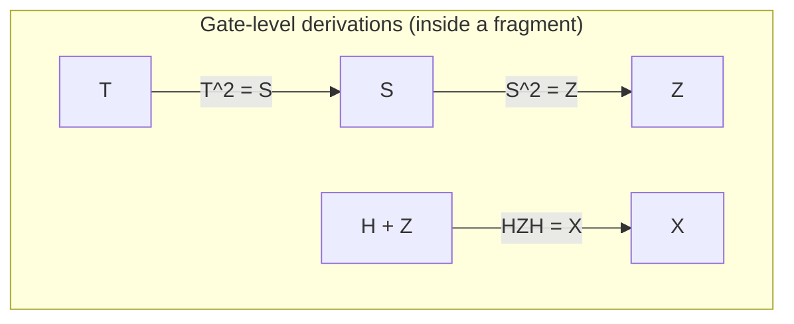
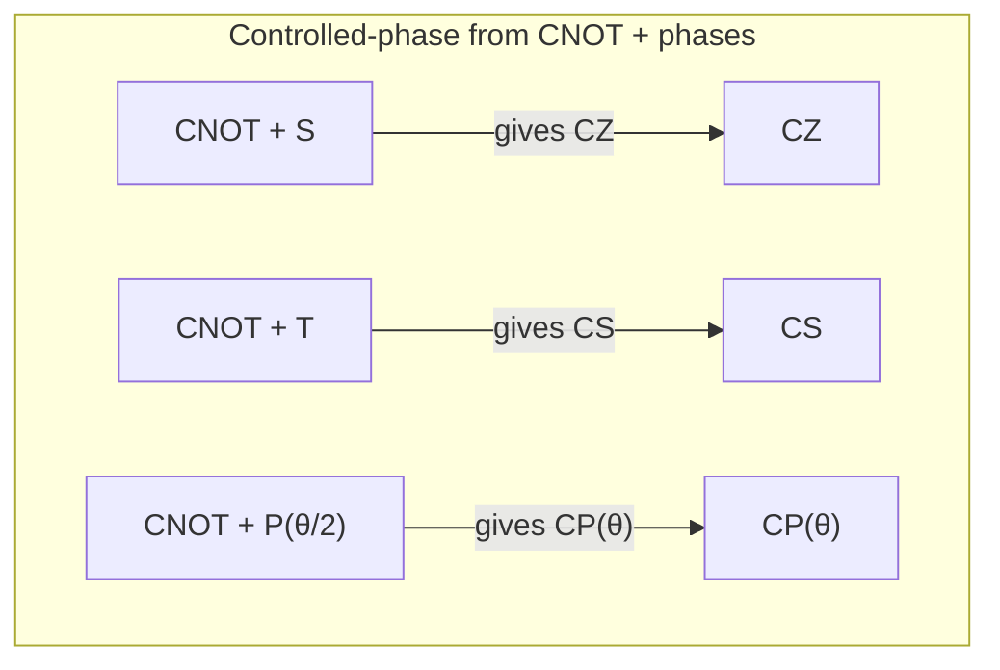
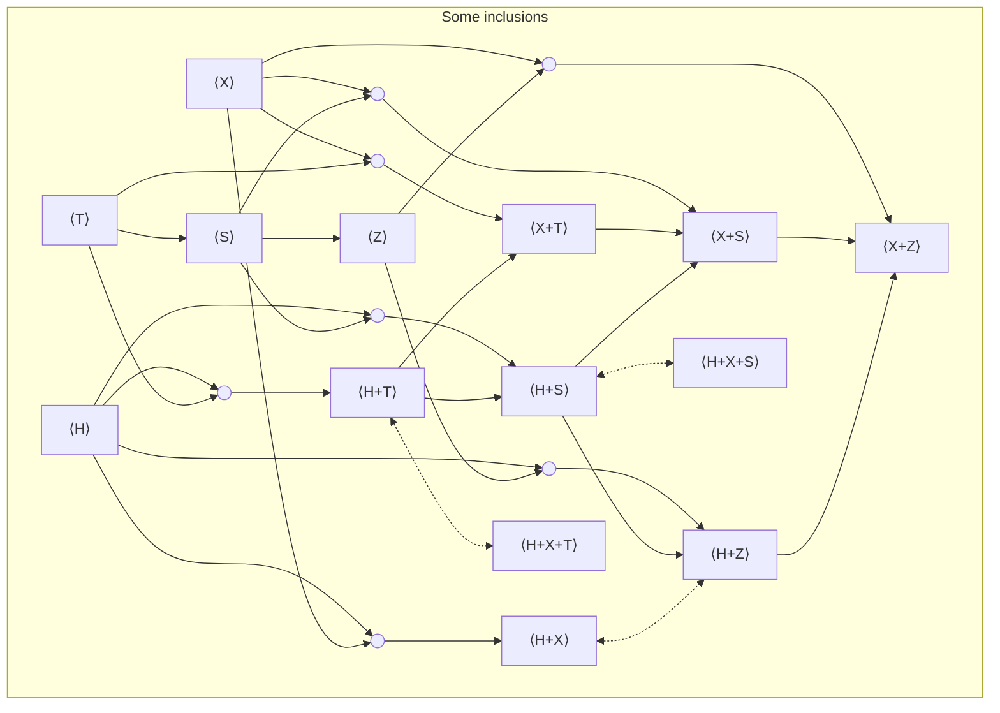

import Callout from "../../components/Callout.astro";

This page is an "atlas" of **gate-set fragments of the quantum circuit model**.

> [!WARNING] Scope and conventions
>
> * This atlas is about **unitary** circuit fragments (no measurement, no discard, no classical control).
> * Unless stated otherwise, circuits are compared **up to global phase**.
> * Gates may be applied to any qubits; hardware connectivity constraints are **out of scope**.
---

## What is a qubit and what is an $n$-qubit state?

> A classical bit is $0$ or $1$.  
> A **qubit** is a unit vector in $\mathbb{C}^2$.
> 
> We choose the **computational basis**
> $$
> |0\rangle = \begin{pmatrix}1\\0\end{pmatrix},\qquad
> |1\rangle = \begin{pmatrix}0\\1\end{pmatrix}.
> $$
>
> A general single-qubit pure state is
> $$
> |\psi\rangle = \alpha |0\rangle + \beta |1\rangle,
> \quad \text{with } \alpha,\beta\in\mathbb{C},\;\;|\alpha|^2+|\beta|^2=1.
> $$

> Two qubits live in $\mathbb{C}^2\otimes \mathbb{C}^2 \cong \mathbb{C}^4$.  
> In general, $n$ qubits live in
> $$
> (\mathbb{C}^2)^{\otimes n}\cong \mathbb{C}^{2^n}.
> $$
> 
> The computational basis states are
> $$
> |x_1x_2\ldots x_n\rangle
> $$ 
> where each $x_i\in\{0,1\}.
> $

> [!INFO] 
> Example : for two qubits, the basis is
> $$
> |00\rangle,|01\rangle,|10\rangle,|11\rangle.
> $$

The key point: **every gate is a linear map**, represented as a matrix.  
Applying a gate to a state means multiplying the matrix by the vector.

When gates are unitary, they preserve inner products and norm (so probabilities stay probabilities).

---

## What is a quantum circuit (syntax)?

> A circuit is built from:
> 
> - **wires** (each wire is a qubit),
> - **gates** (small-arity operations on one or a few wires),
> - **two composition operations**:
>  1. **sequential composition** (do one circuit after another),
>  2. **parallel composition** (place circuits side-by-side on disjoint wires).

> [!TIP]
> A helpful way to think of it:
> 
> - sequential composition corresponds to **matrix multiplication**;
> - parallel composition corresponds to **tensor product** (Kronecker product).

> If $C_1$ denotes a matrix $U_1$ and $C_2$ denotes $U_2$, then running $C_1$ then $C_2$ denotes
> $
> U_2U_1.
> $
> (Notice the order: the circuit drawn left-to-right matches right-to-left matrix multiplication if you're used to function composition.)

> If $C_1$ acts on $n$ qubits and denotes $U_1\in U(2^n)$, and $C_2$ acts on $m$ qubits and denotes $U_2\in U(2^m)$, then putting them side-by-side denotes
> $
> U_1\otimes U_2 \in U(2^{n+m}).
> $

---

## Gate sets

> Fix a collection of gates $G$ (for example $G=\{H,S,\mathrm{CNOT}\}$).
> 
> There are two notions which are important:
> 
> 1. **Gate set**: the primitive generators you allow in circuits.
> 2. **Fragment generated by the gate set**: all circuits you can build from those generators using sequential and parallel composition (and identities, and typically wire swaps).

> [!INFO]
> The fragment is the closure:
> - You can use a gate any number of times.
> - You can apply it on any wires (with swaps if you allow them).
> - You can compose gates sequentially and in parallel.

---

## Why do fragments matter?

Restricting gates sounds like throwing power away. In reality, it's exactly how most theory and tooling becomes *usable*.

> [!INFO]
> Real devices implement a limited menu of calibrated operations. 
> 
> Even if the physics is universal, what you can do **exactly** may be a small fragment, and what you can do **approximately** depends on synthesis.
> 
> So fragments separate:
> - **exact expressibility** (inside the fragment),
> - **approximation/synthesis** (to reach outside).

> [!INFO]
> Fault-tolerant architectures typically make some operations much cheaper than others. 
> 
> A very common pattern is:
> 
> - Clifford operations are "easy" (transversal, or low overhead),
> - non-Clifford gates (often T) are "expensive" (magic state distillation, injection, etc.).

> [!TIP]
> That makes "Clifford+T" a practical sweet spot: you work in a fragment-aware cost model like:
> - T-count,
> - T-depth,
> - number of magic states, etc.

> [!INFO]
> Some fragments are classically efficiently simulable:
> 
> - Stabilizer / Clifford circuits (Gottesman-Knill).
> - Purely diagonal commuting phases of limited structure.
> - Some structured "almost-Clifford" families.
> 
> But tiny extensions can cross to universality:
> - "Clifford + any non-Clifford single-qubit gate" is a common universality trigger.
> - "Clifford + T" is the canonical example.

Fragments show you where the complexity jumps, and what structured intermediate fragments look like.

> [!INFO]
> Many fragments have clean algebraic semantics:
> 
> - CNOT-only corresponds to invertible linear maps over $\mathbb{F}_2$.
> - CNOT+X corresponds to affine maps.
> - Stabilizer circuits correspond to symplectic transformations plus phase data.
> - Diagonal phase fragments correspond to phase polynomials.

> [!TIP]
> Once you identify the algebra, you get:
> - invariants,
> - normal forms,
> - equivalence checks,
> - synthesis algorithms.

> [!INFO]
> Circuit optimization and verification are rewriting tasks:
> 
> - Replace a subcircuit by an equivalent subcircuit.
> - Prove two circuits implement the same map.

> An **equational theory** is a set of rewrite rules (equations) that generate all valid equalities.
> 
> Important properties:
> 
> - **Soundness**: every rewrite preserves semantics.
> - **Completeness**: if two circuits are semantically equal, you can derive that equality from the rules.
> - **Minimality**: no rule is redundant (cannot be derived from the others).

> A **normal form** is a canonical representative for each semantic element:
> - ideally unique (so equality reduces to syntactic comparison),
> - often algorithmic (a rewrite procedure that always terminates).

---

## Notation: what does `H+S+CNOT` mean?

> I'll write expressions like `H+S+CNOT` to mean "the fragment generated by these gates":
> $$
> \langle H, S, \mathrm{CNOT} \rangle,
> $$
> i.e. the smallest fragment that contains those gates (and identities) and is closed under sequential and parallel composition (and typically wire permutations).

> [!WARNING]
> Important: 
> 
> The symbol $+$ is **not** addition.  
> Read it as "generated by".

---

## Gates we will use (generators and their semantics)

Throughout, we use the computational basis $\{|0\rangle,|1\rangle\}$.

### Global phases (optional)

If you explicitly track global phase, you may allow scalar gates.

> - Continuous global phase:
>  $$
>  s(\alpha) := e^{i\alpha}.
>  $$

> - Root of unity:
>  $$
>  \omega_k := e^{2\pi i/k}.
>  $$

> [!TIP]
> If you're working up to global phase, you typically drop these, so we usually don't really care about them.

### Single-qubit gates

> - Hadamard:
>  $$
>  H = \frac{1}{\sqrt 2}\begin{pmatrix}1&1\\1&-1\end{pmatrix}.
>  $$

> - Paulis:
>  $$
>  X = \begin{pmatrix}0&1\\1&0\end{pmatrix},\quad
>  Z = \begin{pmatrix}1&0\\0&-1\end{pmatrix}.
>  $$

> - Phase gate / $Z$-rotation family:
>  $$
>  P(\theta) = \begin{pmatrix}1&0\\0&e^{i\theta}\end{pmatrix}.
>  $$
>  Special cases:
>  $$
>  S := P(\tfrac{\pi}{2})=\begin{pmatrix}1&0\\0&i\end{pmatrix},\quad
>  T := P(\tfrac{\pi}{4})=\begin{pmatrix}1&0\\0&e^{i\pi/4}\end{pmatrix},\quad
>  Z := P(\pi).
>  $$

> [!TIP] Useful identities:
>
>  - $T^2=S$,
>  - $S^2=Z$,
>  - $T^4=Z$,
>  - $P(\alpha)P(\beta)=P(\alpha+\beta)$ and $P(\theta+2\pi)=P(\theta)$.

> Note: $P(\theta)$ is a "phase shift" gate. Up to a global phase it matches the usual $R_z(\theta)$ convention (different communities differ by a global phase convention).

### Two-qubit controlled gates

> - CNOT (control first, target second):
>  $$
>  \mathrm{CNOT}:|a,b\rangle\mapsto |a,\, b\oplus a\rangle,\qquad
>  \mathrm{CNOT}=
>  \begin{pmatrix}
>  1&0&0&0\\
>  0&1&0&0\\
>  0&0&0&1\\
>  0&0&1&0
>  \end{pmatrix}.
>  $$

> - Controlled-phase:
>  $$
>  CP(\theta)=\mathrm{diag}(1,1,1,e^{i\theta}).
>  $$
>  Special cases:
>  $$
>  CZ := CP(\pi)=\mathrm{diag}(1,1,1,-1),\quad
>  CS := CP(\tfrac{\pi}{2})=\mathrm{diag}(1,1,1,i).
>  $$

---

## A "map" of the circuit fragment landscape

Before the big table, here's a conceptual map of the most common regions:

### Local vs entangling fragments

> - **Local fragments**: only single-qubit gates; no entanglement is ever created.
>  Example: `H+S` acting independently on each qubit.
>  Semantically, on $n$ qubits, these fragments look like "a product of $n$ copies of a 1-qubit group", e.g. $\mathcal{C}_1^{\times n}$.

> - **Entangling fragments**: include a 2-qubit entangling gate like CNOT or CZ.
>  Example: `CNOT+H+S` (the Clifford fragment).

### "Classical reversible" region

If you restrict to gates that permute computational basis states, you get reversible classical computations.

> - `CNOT` gives linear reversible maps: $x \mapsto Ax$ over $\mathbb{F}_2$.
> - `CNOT+X` gives affine reversible maps: $x \mapsto Ax + b$.

These show up as $GL(n,2)$ and $AGL(n,2)$ in the table.

### Stabilizer / Clifford region

The stabilizer fragment is generated by `CNOT+H+S`.

> [!IMPORTANT]
> This is the boundary of efficient stabilizer simulation and a central object in fault-tolerance.

### "Just beyond Clifford": diagonal / CNOT-dihedral / phase polynomial

A lot of practical compilation lives in fragments that are "Clifford plus structured phases".

> Examples in the table include:
> - `CNOT+T` and `CNOT+X+T`,
> - `CNOT+P(\theta)` (phase polynomial circuits).

> These are often described by polynomials over $\mathbb{F}_2$ that encode which basis states pick up which phases.

### Universal fragments

> Adding enough continuous parameters (like all $P(\theta)$ plus $H$ and CNOT) gives full $U(2^n)$.

> Adding a discrete non-Clifford like T gives the standard exact gate library for fault-tolerant compilation (universal by approximation, and exact in the appropriate algebraic number ring).

---

## Equational theories and normal forms: what the table is tracking

When the table says "Complete / Minimal / Normal Form", it's about *reasoning inside that fragment*.

### Complete equational theory (presentation)

> [!TIP] 
> A set of circuit equations is complete for a fragment if:
> 
> Whenever two fragment circuits denote the same unitary (or the same projective unitary if working up to global phase), you can derive their equality using those equations.

> [!INFO]
> In group language: 
> 
> It gives a presentation of the semantic group of the fragment (uniformly in $n$, if possible).

### Minimal

> [!TIP]
> A presentation is minimal if no listed equation is derivable from the others.

Minimality is useful because it tells you you're not carrying redundant axioms and, more deeply, it can tell you something about what kinds of relations are *fundamentally necessary*.

### Normal form

> [!TIP]
> A normal form is a canonical circuit shape such that:
> 
> - every element of the fragment can be rewritten into that shape;
> - ideally, that shape is unique for each semantic element.

> [!INFO]
> If you have a unique normal form, equivalence checking becomes:
>
> 1. rewrite both circuits to normal form,
> 2. check syntactic equality.

---

## The atlas: how to read the fragment table

> [!TIP] Table columns
> - **Generators**: the gate set you start from.
> - **Math. name**: the standard algebraic object associated with the $n$-qubit slice (often a group up to phase).
> - **Alternative name**: what you'll often hear in circuit/compiler discussions.
> - **Complete**: is a complete equational theory/presentation known (for the intended scope)?
> - **Minimal**: is that presentation proven minimal?
> - **Normal Form**: is a deterministic normal form known (often unique; sometimes only for small $n$)?

> [!INFO]
> - `☑️ [k]` = established in reference `[k]` (or standard finite-group presentation).
> - `~ [k]` = only for bounded qubit counts / special cases / or the reference has the idea but not a clean explicit statement.
> - `?` = a clean "best" reference not pinned down here.

---

## The atlas table (qubits)

| Generators | Math. name  | Alternative name | Complete | Minimal | Normal Form |
| --- | --- | --- | --- | --- | --- |
| $\omega_k$ | $C_k$ | Discrete global phases | ☑️ [1] | ☑️ [1] | ☑️ [1] |
| $s(\alpha)$ | $U(1)$ | All global phases |  ☑️ [2] | ☑️ [2] | ☑️ [2] |
| $X$ | $C_2^{\,n}$ | Local Pauli‑$X$ (bit flips) | ☑️ [1] | ☑️ [1] | ☑️ [1] |
| $Z$ | $C_2^{\,n}$ | Local Pauli‑$Z$ | ☑️ [1] | ☑️ [1] | ☑️ [1] |
| $S$ | $C_4^{\,n}$ | Local phase ($S$) gates | ☑️ [1] | ☑️ [1] | ☑️ [1] |
| T | $C_8^{\,n}$ | Local T / $\pi/8$ gates | ☑️ [1] | ☑️ [1] | ☑️ [1] |
| $P(\theta)$ | $(U(1))^{\,n}$ | Local $Z$‑rotations |  ☑️ [2] | ☑️ [2] | ☑️ [2] |
| $H+Z$ | $D_4^{\times n}$ | Local real Clifford (no entangling) | ☑️ [5] | ☑️ [16] | ☑️ [5] |
| $H+S$ | $\mathcal{C}_1^{\times n}$ | Local Clifford (no entangling) | ☑️ [4] | ☑️ [16] | ☑️ [4] |
| $H+T$ | $\mathrm{Clifford{+}T}_1^{\times n}$ | Local Clifford+T (no entangling) | ☑️ [6] | ☑️ [16] | ☑️ [11] |
| $H+P(\theta)$ | $\mathrm{U}(2)^{\times n}$ | Local unitaries ($\mathrm{LU}$) | ☑️ [9] | ☑️ [9] | ☑️ [9] |
| $X+Z$ | $(C_2)^{2n}$ | Projective Pauli (Paulis mod global phase) | ☑️ [20] | ☑️ [20] | ☑️ [20] |
| $X+Z+i$ | $\mathcal{P}_n$ | Pauli group ($n$ qubits) | ☑️ [15] |☑️ [15] | ☑️ [21] |
| $X+S$  | $D_4^{\times n}$ | Local dihedral (order 8) | ☑️ [3] | ☑️ [3] | ☑️ [3] |
| $X+T$  | $D_8^{\times n}$ | Local dihedral (order 16) | ☑️ [3] | ☑️ [3] | ☑️ [3] |
| $X+P(\pi/2^k)$ | $D_{2^{k+1}}^{\times n}$ | Local dihedral (2‑power) | ☑️ [3] | ☑️ [3] | ☑️ [3] |
| $X+P(\theta)$ | $\big((U(1))^{2}\rtimes C_2\big)^{\times n}$ | Local monomial unitaries | ? | ? | ? |
| $\mathrm{CZ}$ | $\mathbb{Z}_2^{\binom{n}{2}}$ | Graphs | ? | ? | ? |
| $\mathrm{CNOT}$ | $\mathrm{GL}(n,2)$ | Linear reversible | ☑️ [12] | ? | ☑️ [12] |
| $\mathrm{CNOT}+H$ | ? | CNOT+H circuits | ? | ? | ? |
| $\mathrm{CNOT}+X$ | $\mathrm{AGL}(n,2)$ | Affine reversible | ☑️ [14] | ? | ☑️ [14] |
| $\mathrm{CNOT}+Z$ | $C_2^n \rtimes GL(n,2)$ | CNOT+Z circuits| ? | ? | ? |
| $\mathrm{CNOT}+S$ | ? | CNOT+S circuits | ? | ? | ? |
| $\mathrm{CNOT}+T$ | ? | CNOT+T circuits | ? | ? | ? |
| $\mathrm{CNOT}+P(\theta)$ | $(U(1))^{2^n} \rtimes GL(n,2)$ | Phase-polynomial circuits | ? | ? | ? |
| $\mathrm{CNOT}+H+Z$ | $\mathrm{Real\,Clifford}_n$ | Real stabilizer circuits | ☑️ [5] | ☑️ [16] | ☑️ [5] |
| $\mathrm{CNOT}+H+S$ | $\mathcal{C}_n$ | Stabilizer / Clifford circuits | ☑️ [4] | ☑️ [16] | ☑️ [4] |
| $\mathrm{CNOT}+H+T$ | $\mathrm{Clifford{+}T}_n$ | Clifford+T| ~ [6] | ~ [16] | ~ [6] |
| $\mathrm{CNOT}+H+P(\theta)$ | $\mathrm{U}(2^n)$ | Universal | ☑️ [9] | ☑️ [9] | ? |
| $\mathrm{CNOT}+X+Z$ | $(C_2)^{2n} \rtimes \mathrm{GL}(n,2)$ | CNOT+Pauli (mod phase) | ~ [8] | ~ [16] | ~ [8] |
| $\mathrm{CNOT}+X+Z+i$ | $\mathcal{P}_n \rtimes \mathrm{GL}(n,2)$ | CNOT+Pauli | ? | ? | ? |
| $\mathrm{CNOT}+X+S$ | ? | CNOT-dihedral circuits | ~ [8] | ~ [16] | ~ [8] |
| $\mathrm{CNOT}+X+T$ | ? | CNOT-dihedral circuits | ☑️ [8] | ☑️ [16] | ☑️ [8] |
| $\mathrm{CNOT}+X+P(\pi/2^k)$ | ? | Generalised CNOT-dihedral | ~ [8] | ~ [16] | ~ [8] |
| $\mathrm{CNOT}+X+P(\theta)$ | $(U(1))^{2^n}\rtimes AGL(n,2)$ | Affine phase-polynomial | ? | ? | ? |
| $\mathrm{CCZ}+\mathrm{CNOT}+H+S$ | ? | Clifford+Toffoli | ? | ? | ? |
| $\mathrm{CS}+H+S$ | $\mathrm{Clifford{+}CS}_n$ | Clifford+CS | ~ [7] | ~ [16] | ~ [7] |
| $\mathrm{CZ}+S$ | $\mathrm{Clifford}_n^{\mathrm{diag}}$ | Diagonal Clifford | ? | ? | ☑️ [12] |
| $\mathrm{CNOT}\!\downarrow+\mathrm{CZ}+X+S$ | $\mathcal{B}_n$ | Borel subgroup | ? | ? | ? |
| $\mathrm{CP}(\theta)+P(\theta)$ | ? | Diagonal commuting phase gates | ? | ? | ? |
| $\mathrm{CNOT}+X+\mathrm{CCNOT}$ | $A_{2^n}$ | Reversible Boolean functions | ? | ? | ? |
| $\mathrm{SWAP}$ | $\mathcal{S}_n$ | Symmetric group | ☑️ [13] | ? | ? |
| $\mathrm{SWAP}+H$ | $C_2^n \rtimes S_n$ | Weyl group | ? | ? | ? |
| $\mathrm{SWAP}+\mathrm{CZ}$ | ? | SWAP+CZ circuits | ? | ? | ☑️ [12] |

---

## Qudits (non-qubit rows)

| Dim. | Generators | Math. name  | Alternative name | Complete | Minimal | Normal Form |
| --- | --- | --- | --- | --- | --- | --- |
| 3 | $H+S+\mathrm{SUM}$ | ? | Qutrit stabilizer | ☑️ [10] | ~ [16] | ☑️ [10] |
| d | $H+S+\mathrm{SUM}$ | ? | Qudit stabilizer | ? | ? | ? |
| 3 | $H+S+T+\mathrm{SUM}$ | ? | Qutrit Clifford+T | ? | ? | ☑️ [17] |
| d | $H+S+T+\mathrm{SUM}$ | ? | Qudit Clifford+T | ? | ? | ☑️ [18] |
| 3 | $H+S+R+\mathrm{SUM}$ | ? | Qutrit Clifford+R / Metaplectic | ? | ? | ? |
| 3 | $X+\mathrm{SUM}+CCX+H+T_k$ | Clifford-cyclotomic (degree 3^k) | Qutrit Toffoli+Hadamard (k=1), Clifford+T_k (k>1) | ? | ? | ~ [19] |
---

> [!INFO]
> This fragment table is meant as a quick atlas, not a full survey.

> [!WARNING]
> Some rows depend on conventions (global phase vs projective).

## Fragment inclusions and quick derivations (qubits, $d=2$)

This section is a "navigation aid": if you have one gate set, what else do you automatically get?

I'll keep the original quick facts, but I'll also explain the mechanism behind each one.

###  From powers and conjugation

> [!TIP]
> These are purely algebraic identities:
>
> - $S \implies Z$ because $Z=S^2$.
> - $T \implies S$ because $S=T^2$.
> - $H$ and $Z \implies X$ because $X=HZH$.

Why this matters: if you list $H$ and $Z$ as generators, you don't need to separately list $X$ — it's already in the generated fragment.

### Discrete global phase from non-commuting 1q gates

When you *do* keep track of global phase (work in $U(2^n)$, not $PU(2^n)$), some 1‑qubit gate sets generate nontrivial scalars automatically.

> A standard trick is: if two gates don't commute, their product can sometimes become a scalar.
>
> - $X+P(2\pi/k) \implies \omega_k$, since
>  $$
>  P\!\left(\tfrac{2\pi}{k}\right) X P\!\left(\tfrac{2\pi}{k}\right) X
>  =
>  \mathrm{diag}(\omega_k,\omega_k)
>  =
>  \omega_k I
>  =
>  \omega_k \otimes Id.
>  $$

> - In particular, $H+S \implies \omega_8$, because
>   $$
>   HSHSHS = (HS)^3 = \omega_8 I = \omega_8 \otimes Id.
>   $$

> [!INFO]
> Interpretation: 
>
> Even if you didn't include "global phase generators", the fragment might contain them anyway once you close under composition.

### Controlled-phase from CNOT + phases

A very common identity is that you can build controlled-$Z$-type phases from CNOTs and single-qubit $Z$-rotations.

> Using
> $$
> CP(\theta) = (P(\tfrac{\theta}{2})\otimes P(\tfrac{\theta}{2}))\mathrm{CNOT}(I\otimes P(-\tfrac{\theta}{2}))\mathrm{CNOT},
> $$
> we get:
> 
> - $CNOT+S \implies CZ$ (take $\theta=\pi$),
> - $CNOT+T \implies CS$ (take  $\theta=\pi/2$),
> - more generally $CNOT+P(\theta/2) \implies CP(\theta)$.

> [!INFO]
> This identity is one reason "phase polynomial" and "CNOT-dihedral" styles of compilation are so natural: 
> 
> CNOTs move parity information around; phase gates attach phases conditional on parity.

### CNOT vs CZ (with Hadamard)

> CNOT and CZ are interconvertible with Hadamards on the target wire:
> 
> - $CNOT+H \implies CZ$ and $CZ+H \implies CNOT$ (by conjugating the target with $H$).

> Explicitly:
> $$
> (I\otimes H)\, \mathrm{CNOT}\, (I\otimes H) = CZ.
> $$

> [!INFO]
> So "CNOT-based" and "CZ-based" entangling fragments often differ only superficially when H is available.

---

## References

[1] https://proofwiki.org/wiki/Cyclic_Group/Group_Presentation

[2] https://en.wikipedia.org/wiki/Circle_group#:~:text=integer%20multiples%20of%20%E2%81%A0Image%3A%20,Z%7D%20%7D%E2%81%A0

[3] https://proofwiki.org/wiki/Dihedral_Group/Group_Presentation

[4] https://arxiv.org/abs/1310.6813

[5] https://arxiv.org/abs/2109.05655

[6] https://arxiv.org/abs/2204.02217

[7] https://arxiv.org/abs/2306.08530

[8] https://arxiv.org/abs/1701.00140

[9] https://arxiv.org/abs/2311.07476

[10] https://arxiv.org/abs/2508.14670

[11] https://arxiv.org/abs/1312.6584

[12] https://arxiv.org/abs/2012.09224

[13] https://www.math.auckland.ac.nz/~conder/preprints/SymGpPresentations.pdf

[14] https://www.sciencedirect.com/science/article/pii/S0022404903000690 

[15] https://groupprops.subwiki.org/wiki/Central_product_of_D8_and_Z4

[16] Upcoming work..

[17] https://arxiv.org/abs/1803.03228

[18] https://arxiv.org/abs/2011.07970

[19] https://arxiv.org/abs/2405.08136

[20] https://en.wikipedia.org/wiki/Klein_four-group

[21] https://en.wikipedia.org/wiki/Pauli_group