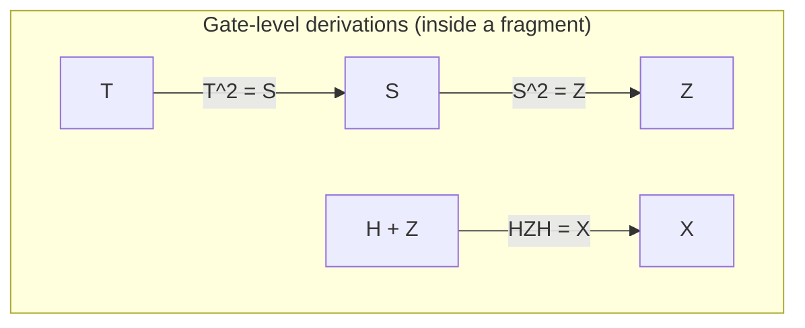
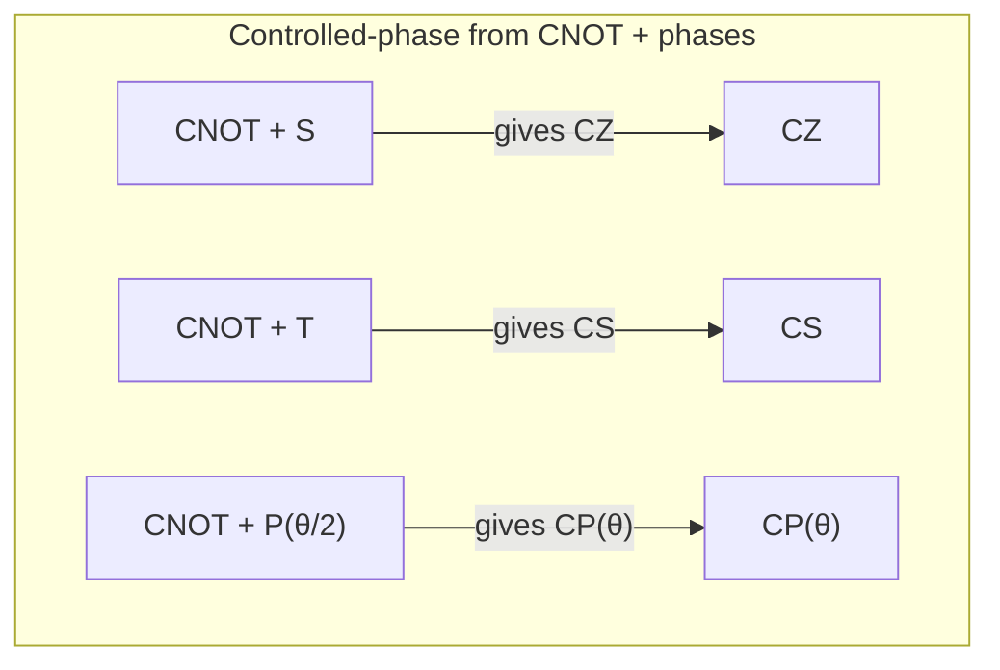
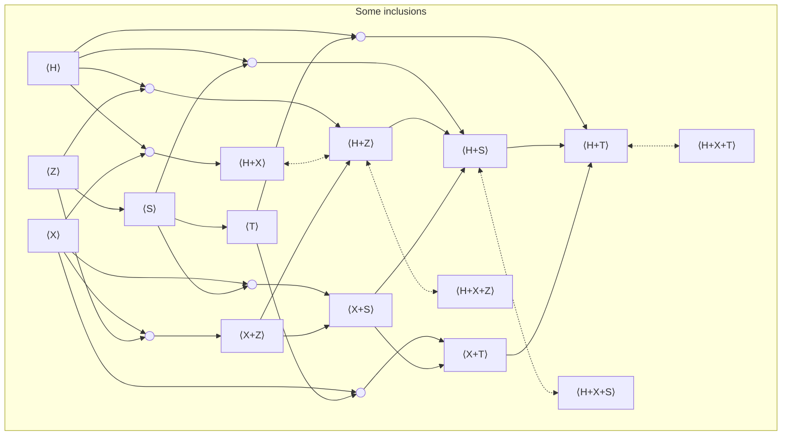

import Callout from "../../components/Callout.astro";

This page is meant as a compact "atlas" of gate-set fragments of the quantum circuit model, by which I mean: you start with a small list of allowed gates (your *generators*), and you look at *everything you can build* by composing those gates into circuits, which is the *fragment* generated by that list.

> [!WARNING] Scope and conventions
>
> - This atlas is about **unitary** circuit fragments, which means we only consider **reversible** quantum evolutions represented by unitary matrices; in particular, we do **not** include measurement, discarding (tracing out), or classical control.
> - Gates may be applied to any qubits, and we ignore physical connectivity constraints (nearest-neighbour layouts, coupling graphs, etc.), since hardware routing is a separate layer of compilation.

---

## What is a qubit and what is an $n$-qubit state?

A classical bit is either $0$ or $1$, so it is a single binary value with two possible outcomes.  
A **quantum bit**, usually shortened to **qubit**, is described (in the simplest "pure state" model) by a *unit vector* in $\mathbb{C}^2$, meaning a 2-dimensional complex vector whose total length is 1 (this "length" is computed using the usual complex inner product, and it is what makes probabilities add up correctly).

Because complex numbers can look abstract at first, it helps to remember that a complex number is just $a+ib$ with $a,b\in\mathbb{R}$ and $i^2=-1$, so a "complex vector" is simply a vector whose entries are of that form.

> There are different bases one could use to write a qubit state, but the most common choice in quantum computing is the **computational basis**
> $$
> |0\rangle = \begin{pmatrix}1\\0\end{pmatrix},\qquad
> |1\rangle = \begin{pmatrix}0\\1\end{pmatrix}.
> $$
> In this basis, a general 1-qubit pure state is written as a linear combination (a weighted sum)
> $$
> |\psi\rangle = \alpha |0\rangle + \beta |1\rangle,
> \quad \text{with } \alpha,\beta\in\mathbb{C},\;\;|\alpha|^2+|\beta|^2=1.
> $$
> The condition $|\alpha|^2+|\beta|^2=1$ is the "unit vector" (normalization) requirement, and it is what ensures that the probabilities you get by measuring in the computational basis add up to 1.

When we want to use multiple qubits, we need a larger state space that can represent all joint configurations.  
Mathematically, this is done using the **tensor product** $\otimes$, which is the standard way to combine quantum systems; for example, two qubits live in
$$
\mathbb{C}^2\otimes \mathbb{C}^2 \cong \mathbb{C}^4,
$$
so you can think of a 2-qubit state as a 4-dimensional complex vector once you choose an ordering of basis elements.

More generally, $n$ qubits live in
$$
(\mathbb{C}^2)^{\otimes n}\cong \mathbb{C}^{2^n}.
$$

> The computational basis states on $n$ qubits are written
> $$
> |x_1x_2\ldots x_n\rangle
> $$
> where each $x_i\in\{0,1\}$, so there are $2^n$ such basis vectors in total.

> [!INFO]
> Example (two qubits): the computational basis is
> $$
> |00\rangle,\;|01\rangle,\;|10\rangle,\;|11\rangle.
> $$

The key point for circuits is that **every gate is a linear map**, so after choosing a basis it is represented by a matrix, and **applying a gate to a state means multiplying that matrix by the state vector**.  
When the gate is **unitary**, its matrix $U$ satisfies $U^\dagger U = I$ (where $U^\dagger$ is the conjugate transpose), which implies it preserves inner products and norms, and therefore preserves total probability; throughout this article, "gate" always means "unitary gate" unless explicitly stated otherwise.

---

## What is a quantum circuit (syntax)?

A quantum circuit is a *diagrammatic way* to build large linear maps out of small building blocks, and it is constructed from:

- **wires**, where each wire represents a qubit "register line" that carries a qubit state,
- **gates**, which are small-arity operations (meaning they act on one or a few wires at a time),
- **two composition operations**, which tell you how to glue circuits together:
  1. **sequential composition** ("do one circuit after another on the same wires"), and
  2. **parallel composition** ("place circuits side-by-side on disjoint wires").

> [!TIP]
> A helpful translation between diagrams and matrices is:
>
> - sequential composition corresponds to **matrix multiplication**;
> - parallel composition corresponds to the **tensor product** (also called the Kronecker product).

Concretely, if $C_1$ denotes a matrix $U_1$ and $C_2$ denotes $U_2$, then running $C_1$ and then $C_2$ denotes
$$
U_2U_1.
$$
(So the "first thing you do" appears on the right in the matrix product, which is the same convention as function composition.)

Similarly, if $C_1$ acts on $n$ qubits and denotes $U_1\in U(2^n)$, and $C_2$ acts on $m$ qubits and denotes $U_2\in U(2^m)$, then placing them side-by-side denotes
$$
U_1\otimes U_2 \in U(2^{n+m}).
$$
Here $U(d)$ means the **unitary group** of all $d\times d$ unitary matrices.

---

## Gate sets

Fix a collection of allowed gates $G$ (for example $G=\{H,S,\mathrm{CNOT}\}$).  
Two closely related notions show up constantly in compilation, simulation, and circuit reasoning:

1. **Gate set**: the primitive generators you allow yourself to use as "basic instructions".
2. **Fragment generated by the gate set**: the set of *all circuits you can build* from those generators by using sequential and parallel composition, together with identity wires and (typically) wire permutations such as SWAPs.

> [!INFO]
> You can think of the fragment as a closure property:
> - you may reuse a gate any number of times,
> - you may apply it on any chosen wires (and if swaps are allowed, you can effectively move wires around),
> - you may compose gates sequentially and in parallel to make larger circuits.

---

## Why do fragments matter?

Restricting gates can sound like giving up expressive power, but in practice it is the main reason that theory and tooling become usable, because fragments are where structure lives.

> [!INFO]
> Real devices implement a limited menu of calibrated operations, 
>
> Even if the underlying physics is universal, the set of operations you can do **exactly** is typically a small fragment, while what you can do **approximately** depends on synthesis algorithms that compile ideal gates into the hardware-native library.
>
> Fragments therefore separate:
> - **exact expressibility** (what lies inside the fragment), from
> - **approximation / synthesis** (how you reach outside, and at what cost).

> [!INFO]
> Fault-tolerant architectures also impose strong "cost asymmetries", 
> 
> meaning some gates are dramatically cheaper than others once you encode qubits into error-correcting codes.
>
> A very common pattern is:
> - Clifford operations are "easy" (often transversal or low-overhead),
> - non-Clifford gates (often $T$) are "expensive" (typically requiring magic state distillation, injection, or related protocols).

> [!TIP]
> This is why Clifford+T is such a practical sweet spot: 
> 
> you reason in a fragment-aware cost model where you track quantities like
> - **T-count** (how many $T$ gates you use),
> - **T-depth** (how many layers of $T$ gates you need when parallelised),
> - number of magic states, etc.

> [!INFO]
> Some fragments are classically efficiently simulable, 
> 
> meaning there are known classical algorithms that can predict their behaviour efficiently (in time polynomial in $n$) for large families of circuits.
>
> Canonical examples include:
> - Stabilizer / Clifford circuits (Gottesman–Knill),
> - certain diagonal commuting phase families of restricted form,
> - some structured "almost-Clifford" families.
>
> What makes fragments especially interesting is that **tiny extensions can trigger universality**, for instance:
> - "Clifford + any non-Clifford single-qubit gate" is a common universality trigger,
> - "Clifford + T" is the canonical fault-tolerant example (universal for approximation).

Fragments show you where complexity jumps, and they also highlight the many structured "in-between" regions that are neither trivial nor fully universal.

> [!INFO]
> Many fragments admit clean algebraic semantics, 
> 
> which is why they show up naturally in optimisation and verification:
>
> - CNOT-only corresponds to invertible linear maps over $\mathbb{F}_2$ (the field with two elements, i.e. bits with XOR as addition).
> - CNOT+X corresponds to affine maps (linear maps plus translations).
> - Stabilizer circuits correspond to symplectic transformations plus phase data.
> - Several diagonal phase fragments can be described by **phase polynomials** (polynomials over $\mathbb{F}_2$ that specify which basis states acquire which phases).

> [!TIP]
> Once you identify the underlying algebra, you often get, almost for free:
> - invariants (quantities that don’t change under rewrites),
> - normal forms (canonical circuit shapes),
> - efficient equivalence checks,
> - and synthesis / optimisation algorithms that exploit the structure.

> [!INFO]
> Circuit optimisation and verification are, at their core, rewriting tasks:
>
> - you replace a subcircuit by another subcircuit with the same semantics,
> - and you prove two circuits implement the same linear map by rewriting them into a comparable form.

An **equational theory** is a chosen set of circuit equations (rewrite rules) intended to generate *all valid equalities* inside a fragment.

Important properties of an equational theory are:

- **Soundness**: every rewrite preserves semantics (so you never rewrite a circuit into something that computes a different unitary).
- **Completeness**: if two circuits are semantically equal, then their equality is derivable from your equations (so your rules are strong enough to prove every true equation in the fragment).
- **Minimality**: no listed equation is redundant (i.e. you cannot derive it from the others).

A **normal form** is a canonical representative for each semantic element, usually presented as a deterministic rewriting strategy:

- ideally the normal form is unique (so equality reduces to syntactic comparison),
- and ideally the rewriting procedure always terminates (so you can actually compute the normal form).

---

## Notation: what does `H+S+CNOT` mean?

I’ll write expressions like `H+S+CNOT` to mean "the fragment generated by these gates", i.e.
$$
\langle H, S, \mathrm{CNOT} \rangle,
$$
which is the smallest fragment that contains those gates (and identities) and is closed under sequential and parallel composition (and typically wire permutations such as swaps).

> [!WARNING]
> The symbol + here is not addition.  
> 
> Read it as "generated by" or "closed under composition of".

---

## Gates we will use (generators and their semantics)

Throughout, we use the computational basis $\{|0\rangle,|1\rangle\}$.  
When I say a gate "has semantics" $U$, I mean that it acts on basis states by $|\psi\rangle \mapsto U|\psi\rangle$, and on general states by linearity.

### Global phases (optional)

A **global phase** is a complex scalar of unit magnitude (a number on the unit circle) that multiplies an entire state vector; physically, global phase is unobservable in standard measurement statistics, but it matters if you are tracking exact equality of unitary matrices rather than equality "up to phase".

> - Continuous global phase:
>  $$
>  s(\alpha) := e^{i\alpha}.
>  $$
>  This ranges over the group $U(1)$, the unit complex numbers.
>
> - A discrete root of unity:
>  $$
>  \omega_k := e^{2\pi i/k}.
>  $$
>  This is a specific global phase of finite order $k$.

> [!TIP]
> If you work up to global phase 
> 
> (i.e. you identify $U$ and $e^{i\alpha}U$ as the same operation), then you typically drop these scalars from the generator list, because they do not affect measurement statistics on pure states.

### Single-qubit gates

> - Hadamard:
>  $$
>  H = \frac{1}{\sqrt 2}\begin{pmatrix}1&1\\1&-1\end{pmatrix}.
>  $$
>  The Hadamard swaps the $Z$-basis and $X$-basis viewpoints, and it is the standard way to create equal superpositions from basis states.
>
> - Paulis:
>  $$
>  X = \begin{pmatrix}0&1\\1&0\end{pmatrix},\quad
>  Z = \begin{pmatrix}1&0\\0&-1\end{pmatrix}.
>  $$
>  Here $X$ flips computational basis states ($|0\rangle\leftrightarrow |1\rangle$), while $Z$ keeps $|0\rangle$ fixed and flips the sign of $|1\rangle$.
>
> - Phase gate / $Z$-rotation family:
>  $$
>  P(\theta) = \begin{pmatrix}1&0\\0&e^{i\theta}\end{pmatrix}.
>  $$
>  This gate leaves the amplitude on $|0\rangle$ unchanged and multiplies the amplitude on $|1\rangle$ by a complex phase $e^{i\theta}$.

Special cases:
$$
S := P(\tfrac{\pi}{2})=\begin{pmatrix}1&0\\0&i\end{pmatrix},\quad
T := P(\tfrac{\pi}{4})=\begin{pmatrix}1&0\\0&e^{i\pi/4}\end{pmatrix},\quad
Z := P(\pi).
$$

> [!TIP] Useful identities (so you don’t carry redundant generators):
>
>  - $T^2=S$,
>  - $S^2=Z$,
>  - $T^4=Z$,
>  - $P(\alpha)P(\beta)=P(\alpha+\beta)$ and $P(\theta+2\pi)=P(\theta)$.

Note: $P(\theta)$ is a "phase shift" gate; up to a global phase, it matches the common $R_z(\theta)$ convention, and different communities choose slightly different global-phase conventions, so it is worth checking which convention a given paper or library is using.

### Two-qubit controlled gates

> - CNOT (control first, target second):
>  $$
>  \mathrm{CNOT}:|a,b\rangle\mapsto |a,\, b\oplus a\rangle,\qquad
>  \mathrm{CNOT}=
>  \begin{pmatrix}
>  1&0&0&0\\
>  0&1&0&0\\
>  0&0&0&1\\
>  0&0&1&0
>  \end{pmatrix}.
>  $$
>  Here $\oplus$ means XOR (addition modulo 2), so the target bit flips exactly when the control bit is $1$.
>
> - Controlled-phase:
>  $$
>  CP(\theta)=\mathrm{diag}(1,1,1,e^{i\theta}).
>  $$
>  This multiplies the $|11\rangle$ amplitude by $e^{i\theta}$ while leaving the other basis states unchanged.

Special cases:
$$
CZ := CP(\pi)=\mathrm{diag}(1,1,1,-1),\quad
CS := CP(\tfrac{\pi}{2})=\mathrm{diag}(1,1,1,i).
$$

---

## A "map" of the circuit fragment landscape

Before the big table, here is a conceptual map of the most common regions, phrased in a way that connects the diagram language ("what gates are allowed?") to the semantic language ("what family of matrices do you get?").

### Local vs entangling fragments

> - **Local fragments** contain only single-qubit gates, so they can never create entanglement between different wires; for example, `H+S` acting independently on each qubit is local.
>   Semantically, on $n$ qubits, a local fragment typically looks like "$n$ independent copies of a 1-qubit group", i.e. something like $\mathcal{C}_1^{\times n}$ for local Clifford.
>
> - **Entangling fragments** include at least one genuinely entangling 2-qubit gate such as CNOT or CZ; for example, `CNOT+H+S` is the full Clifford fragment, and it can generate highly entangled stabilizer states.

### "Classical reversible" region

If you restrict to gates that merely **permute computational basis states** (so basis vectors map to basis vectors, not superpositions), you recover reversible classical computation inside the circuit formalism.

> - `CNOT` generates linear reversible maps $x \mapsto Ax$ over $\mathbb{F}_2$.
> - `CNOT+X` generates affine reversible maps $x \mapsto Ax + b$.

In group terms these show up as $GL(n,2)$ and $AGL(n,2)$, where $GL(n,2)$ is the group of invertible $n\times n$ matrices over $\mathbb{F}_2$ and $AGL(n,2)$ is the corresponding affine group.

### Stabilizer / Clifford region

The stabilizer fragment is generated by `CNOT+H+S`.

> [!IMPORTANT]
> This fragment is the standard boundary of efficient stabilizer simulation (Gottesman–Knill), 
> 
> and it is a central object in fault-tolerant quantum computing because many codes and protocols are Clifford-native.

### "Just beyond Clifford": diagonal / CNOT-dihedral / phase polynomial

A lot of practical compilation happens in fragments that are "Clifford plus structured phases", because they are expressive enough for many algorithms while still admitting special-purpose optimisation methods.

> Examples in the table include:
> - `CNOT+T` and `CNOT+X+T`,
> - `CNOT+P(\theta)` (phase polynomial circuits).

These families are often described by polynomials over $\mathbb{F}_2$ that encode which basis states acquire which phases, which is why parity computations (CNOT networks) and diagonal phases fit together so naturally.

### Universal fragments

> If you allow continuous single-qubit rotations (like all $P(\theta)$) together with $H$ and an entangling gate like CNOT, you can generate all of $U(2^n)$ (universality).
>
> If you restrict yourself to a discrete non-Clifford gate like $T$, you still get a standard fault-tolerant gate library that is universal by approximation (and exact over an appropriate algebraic ring), which is why Clifford+T dominates many compilation workflows.

---

## Equational theories and normal forms: what the table is tracking

When the table says "Complete / Minimal / Normal Form", it is describing what is known about *reasoning inside that fragment*, i.e. whether we have good rewrite rules and canonical forms for circuit equivalence.

### Complete equational theory (presentation)

> [!TIP]
> A set of circuit equations is complete for a fragment if:
>
> whenever two circuits built from that fragment denote the same unitary (or the same projective unitary, if you work up to global phase), you can derive their equality using those equations.

> [!INFO]
> In group language, 
>
> a complete equational theory gives a **presentation** of the semantic group of the fragment (and the most useful results are uniform in $n$, meaning they work for any number of qubits without having to re-prove everything from scratch).

### Minimal

> [!TIP]
> A presentation is minimal if no listed equation is derivable from the others.

Minimality is useful because it tells you you are not carrying redundant axioms, and, more deeply, it can reveal which kinds of relations are fundamentally necessary to describe the fragment.

### Normal form

> [!TIP]
> A normal form is a canonical circuit shape such that:
>
> - every element of the fragment can be rewritten into that shape;
> - ideally, that shape is unique for each semantic element.

> [!INFO]
> If the normal form is unique, equivalence checking becomes:
>
> 1. rewrite both circuits to normal form,
> 2. check syntactic equality.

---

## The atlas: how to read the fragment table

> [!TIP] Table columns
> - **Generators**: the gate set you start from.
> - **Math. name**: the standard algebraic object associated with the $n$-qubit slice (often a group up to phase).
> - **Alternative name**: what you'll often hear in circuit/compiler discussions.
> - **Complete**: is a complete equational theory/presentation known (for the intended scope)?
> - **Minimal**: is that presentation proven minimal?
> - **Normal Form**: is a deterministic normal form known (often unique; sometimes only for small $n$)?

> [!INFO]
> - `☑️ [k]` = established in reference `[k]` (or standard finite-group presentation).
> - `~ [k]` = only for bounded qubit counts / special cases / or the reference has the idea but not a clean explicit statement.
> - `?` = a clean "best" reference not pinned down here.

---

## The atlas table (qubits)

| Generators | Math. name  | Alternative name | Complete | Minimal | Normal Form |
| --- | --- | --- | --- | --- | --- |
| $\omega_k$ | $C_k$ | Discrete global phases | ☑️ [1] | ☑️ [1] | ☑️ [1] |
| $s(\alpha)$ | $U(1)$ | All global phases |  ☑️ [2] | ☑️ [2] | ☑️ [2] |
| $X$ | $C_2^{\,n}$ | Local Pauli‑$X$ (bit flips) | ☑️ [1] | ☑️ [1] | ☑️ [1] |
| $Z$ | $C_2^{\,n}$ | Local Pauli‑$Z$ | ☑️ [1] | ☑️ [1] | ☑️ [1] |
| $S$ | $C_4^{\,n}$ | Local phase ($S$) gates | ☑️ [1] | ☑️ [1] | ☑️ [1] |
| T | $C_8^{\,n}$ | Local T / $\pi/8$ gates | ☑️ [1] | ☑️ [1] | ☑️ [1] |
| $P(\theta)$ | $(U(1))^{\,n}$ | Local $Z$‑rotations |  ☑️ [2] | ☑️ [2] | ☑️ [2] |
| $H+Z$ | $D_4^{\times n}$ | Local real Clifford (no entangling) | ☑️ [5] | ☑️ [16] | ☑️ [5] |
| $H+S$ | $\mathcal{C}_1^{\times n}$ | Local Clifford (no entangling) | ☑️ [4] | ☑️ [16] | ☑️ [4] |
| $H+T$ | $\mathrm{Clifford{+}T}_1^{\times n}$ | Local Clifford+T (no entangling) | ☑️ [6] | ☑️ [16] | ☑️ [11] |
| $H+P(\theta)$ | $\mathrm{U}(2)^{\times n}$ | Local unitaries ($\mathrm{LU}$) | ☑️ [9] | ☑️ [9] | ☑️ [9] |
| $X+Z$ | $(C_2)^{2n}$ | Projective Pauli (Paulis mod global phase) | ☑️ [20] | ☑️ [20] | ☑️ [20] |
| $X+Z+i$ | $\mathcal{P}_n$ | Pauli group ($n$ qubits) | ☑️ [15] |☑️ [15] | ☑️ [21] |
| $X+S$  | $D_4^{\times n}$ | Local dihedral (order 8) | ☑️ [3] | ☑️ [3] | ☑️ [3] |
| $X+T$  | $D_8^{\times n}$ | Local dihedral (order 16) | ☑️ [3] | ☑️ [3] | ☑️ [3] |
| $X+P(\pi/2^k)$ | $D_{2^{k+1}}^{\times n}$ | Local dihedral (2‑power) | ☑️ [3] | ☑️ [3] | ☑️ [3] |
| $X+P(\theta)$ | $\big((U(1))^{2}\rtimes C_2\big)^{\times n}$ | Local monomial unitaries | ? | ? | ? |
| $\mathrm{CZ}$ | $\mathbb{Z}_2^{\binom{n}{2}}$ | Graphs | ? | ? | ? |
| $\mathrm{CNOT}$ | $\mathrm{GL}(n,2)$ | Linear reversible | ☑️ [12] | ? | ☑️ [12] |
| $\mathrm{CNOT}+H$ | ? | CNOT+H circuits | ? | ? | ? |
| $\mathrm{CNOT}+X$ | $\mathrm{AGL}(n,2)$ | Affine reversible | ☑️ [14] | ? | ☑️ [14] |
| $\mathrm{CNOT}+Z$ | $C_2^n \rtimes GL(n,2)$ | CNOT+Z circuits| ? | ? | ? |
| $\mathrm{CNOT}+S$ | ? | CNOT+S circuits | ? | ? | ? |
| $\mathrm{CNOT}+T$ | ? | CNOT+T circuits | ? | ? | ? |
| $\mathrm{CNOT}+P(\theta)$ | $(U(1))^{2^n} \rtimes GL(n,2)$ | Phase-polynomial circuits | ? | ? | ? |
| $\mathrm{CNOT}+H+Z$ | $\mathrm{Real\,Clifford}_n$ | Real stabilizer circuits | ☑️ [5] | ☑️ [16] | ☑️ [5] |
| $\mathrm{CNOT}+H+Z+\mathrm{CH}$ | ? | Real stabilizer+CH circuits | ☑️ [22] | ? | ? |
| $\mathrm{CNOT}+H+S$ | $\mathcal{C}_n$ | Stabilizer / Clifford circuits | ☑️ [4] | ☑️ [16] | ☑️ [4] |
| $\mathrm{CNOT}+H+T$ | $\mathrm{Clifford{+}T}_n$ | Clifford+T| ~ [6] | ~ [16] | ~ [6] |
| $\mathrm{CNOT}+H+P(\theta)$ | $\mathrm{U}(2^n)$ | Universal | ☑️ [9] | ☑️ [9] | ? |
| $\mathrm{CNOT}+X+Z$ | $(C_2)^{2n} \rtimes \mathrm{GL}(n,2)$ | CNOT+Pauli (mod phase) | ~ [8] | ~ [16] | ~ [8] |
| $\mathrm{CNOT}+X+Z+i$ | $\mathcal{P}_n \rtimes \mathrm{GL}(n,2)$ | CNOT+Pauli | ? | ? | ? |
| $\mathrm{CNOT}+X+S$ | ? | CNOT-dihedral circuits | ~ [8] | ~ [16] | ~ [8] |
| $\mathrm{CNOT}+X+T$ | ? | CNOT-dihedral circuits | ☑️ [8] | ☑️ [16] | ☑️ [8] |
| $\mathrm{CNOT}+X+P(\pi/2^k)$ | ? | Generalised CNOT-dihedral | ~ [8] | ~ [16] | ~ [8] |
| $\mathrm{CNOT}+X+P(\theta)$ | $(U(1))^{2^n}\rtimes AGL(n,2)$ | Affine phase-polynomial | ? | ? | ? |
| $\mathrm{CCZ}+\mathrm{CNOT}+H+S$ | ? | Clifford+Toffoli | ? | ? | ? |
| $\mathrm{CS}+H+S$ | $\mathrm{Clifford{+}CS}_n$ | Clifford+CS | ~ [7] | ~ [16] | ~ [7] |
| $\mathrm{CZ}+S$ | $\mathrm{Clifford}_n^{\mathrm{diag}}$ | Diagonal Clifford | ? | ? | ☑️ [12] |
| $\mathrm{CNOT}\!\downarrow+\mathrm{CZ}+X+S$ | $\mathcal{B}_n$ | Borel subgroup | ? | ? | ? |
| $\mathrm{CP}(\theta)+P(\theta)$ | ? | Diagonal commuting phase gates | ? | ? | ? |
| $\mathrm{CNOT}+X+\mathrm{CCNOT}$ | $A_{2^n}$ | Reversible Boolean functions | ? | ? | ? |
| $\mathrm{SWAP}$ | $\mathcal{S}_n$ | Symmetric group | ☑️ [13] | ? | ? |
| $\mathrm{SWAP}+H$ | $C_2^n \rtimes S_n$ | Weyl group | ? | ? | ? |
| $\mathrm{SWAP}+\mathrm{CZ}$ | ? | SWAP+CZ circuits | ? | ? | ☑️ [12] |

---

## Qudits (non-qubit rows)

| Dim. | Generators | Math. name  | Alternative name | Complete | Minimal | Normal Form |
| --- | --- | --- | --- | --- | --- | --- |
| 3 | $H+S+\mathrm{SUM}$ | ? | Qutrit stabilizer | ☑️ [10] | ~ [16] | ☑️ [10] |
| d | $H+S+\mathrm{SUM}$ | ? | Qudit stabilizer | ? | ? | ? |
| 3 | $H+S+T+\mathrm{SUM}$ | ? | Qutrit Clifford+T | ? | ? | ☑️ [17] |
| d | $H+S+T+\mathrm{SUM}$ | ? | Qudit Clifford+T | ? | ? | ☑️ [18] |
| 3 | $H+S+R+\mathrm{SUM}$ | ? | Qutrit Clifford+R / Metaplectic | ? | ? | ? |
| 3 | $X+\mathrm{SUM}+CCX+H+T_k$ | Clifford-cyclotomic (degree $3^k$) | Qutrit Toffoli+Hadamard $(k=1)$, Clifford+$T_k (k>1)$ | ? | ? | ~ [19] |
---

> [!INFO]
> This fragment table is intended as a quick atlas and a navigation aid, 
> 
> not a full survey; for many rows the best references (or the cleanest uniform statements in $n$) are still worth hunting down.

## Fragment inclusions and quick derivations (qubits, $d=2$)

###  From powers and conjugation

> [!TIP]
> These are purely algebraic identities:
>
> - $S \implies Z$ because $Z=S^2$.
> - $T \implies S$ because $S=T^2$.
> - $H$ and $Z \implies X$ because $X=HZH$.

Why this matters: if you list $H$ and $Z$ as generators, you don't need to separately list $X$ — it's already in the generated fragment.

### Discrete global phase from non-commuting 1q gates

When you *do* keep track of global phase (work in $U(2^n)$, not $PU(2^n)$), some 1‑qubit gate sets generate nontrivial scalars automatically.

> A standard trick is: if two gates don't commute, their product can sometimes become a scalar.
>
> - $X+P(2\pi/k) \implies \omega_k$, since
>  $$
>  P\!\left(\tfrac{2\pi}{k}\right) X P\!\left(\tfrac{2\pi}{k}\right) X
>  =
>  \mathrm{diag}(\omega_k,\omega_k)
>  =
>  \omega_k I
>  =
>  \omega_k \otimes Id.
>  $$

> - In particular, $H+S \implies \omega_8$, because
>   $$
>   HSHSHS = (HS)^3 = \omega_8 I = \omega_8 \otimes Id.
>   $$

> [!INFO]
> Interpretation: 
>
> Even if you didn't include "global phase generators", the fragment might contain them anyway once you close under composition.

### Controlled-phase from CNOT + phases

A very common identity is that you can build controlled-$Z$-type phases from CNOTs and single-qubit $Z$-rotations.

> Using
> $$
> CP(\theta) = (P(\tfrac{\theta}{2})\otimes P(\tfrac{\theta}{2}))\mathrm{CNOT}(I\otimes P(-\tfrac{\theta}{2}))\mathrm{CNOT},
> $$
> we get:
> 
> - $CNOT+S \implies CZ$ (take $\theta=\pi$),
> - $CNOT+T \implies CS$ (take  $\theta=\pi/2$),
> - more generally $CNOT+P(\theta/2) \implies CP(\theta)$.

> [!INFO]
> This identity is one reason "phase polynomial" and "CNOT-dihedral" styles of compilation are so natural: 
> 
> CNOTs move parity information around; phase gates attach phases conditional on parity.

### CNOT vs CZ (with Hadamard)

> CNOT and CZ are interconvertible with Hadamards on the target wire:
> 
> - $CNOT+H \implies CZ$ and $CZ+H \implies CNOT$ (by conjugating the target with $H$).

> Explicitly:
> $$
> (I\otimes H)\, \mathrm{CNOT}\, (I\otimes H) = CZ.
> $$

> [!INFO]
> So "CNOT-based" and "CZ-based" entangling fragments often differ only superficially when H is available.

---

## References

[1] https://proofwiki.org/wiki/Cyclic_Group/Group_Presentation

[2] https://en.wikipedia.org/wiki/Circle_group#:~:text=integer%20multiples%20of%20%E2%81%A0Image%3A%20,Z%7D%20%7D%E2%81%A0

[3] https://proofwiki.org/wiki/Dihedral_Group/Group_Presentation

[4] https://arxiv.org/abs/1310.6813

[5] https://arxiv.org/abs/2109.05655

[6] https://arxiv.org/abs/2204.02217

[7] https://arxiv.org/abs/2306.08530

[8] https://arxiv.org/abs/1701.00140

[9] https://arxiv.org/abs/2311.07476

[10] https://arxiv.org/abs/2508.14670

[11] https://arxiv.org/abs/1312.6584

[12] https://arxiv.org/abs/2012.09224

[13] https://www.math.auckland.ac.nz/~conder/preprints/SymGpPresentations.pdf

[14] https://www.sciencedirect.com/science/article/pii/S0022404903000690 

[15] https://groupprops.subwiki.org/wiki/Central_product_of_D8_and_Z4

[16] Upcoming work..

[17] https://arxiv.org/abs/1803.03228

[18] https://arxiv.org/abs/2011.07970

[19] https://arxiv.org/abs/2405.08136

[20] https://en.wikipedia.org/wiki/Klein_four-group

[21] https://en.wikipedia.org/wiki/Pauli_group

[22] https://hal.science/hal-05487235