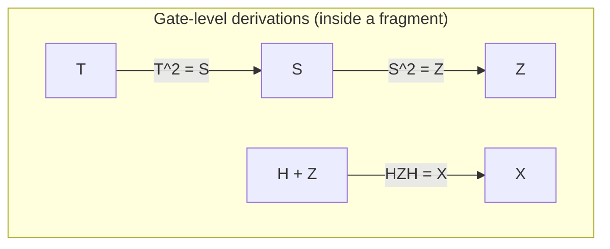
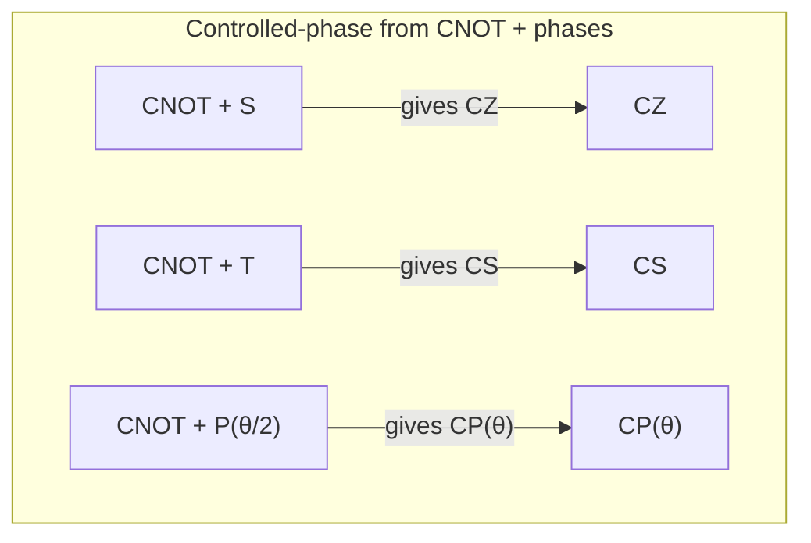
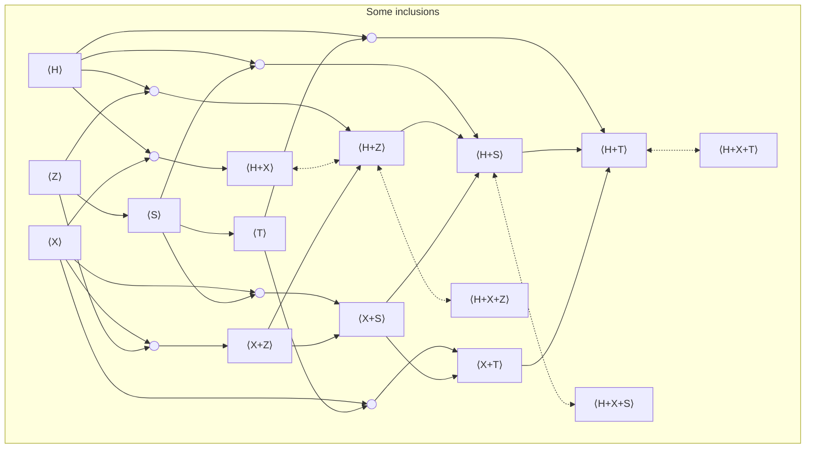

import Callout from "../../components/Callout.astro";

This page is a compact **atlas of quantum “circuit fragments.”** Fix a set of allowed gates $G$, and consider **everything you can build** by composing those gates into unitary circuits (on any number of qubits). That “everything you can build” is the fragment generated by $G$.

If you like a concrete metaphor: a **gate set** is your bag of LEGO bricks; a **fragment** is the class of circuits you can assemble from them.

The atlas table near the end is meant to answer three practical questions for many common gate sets:

1. **Expressivity:** what family of unitaries do you get (exactly)?
2. **Reasoning:** do we have a usable “law book” of rewrite rules to prove two circuits equivalent?
3. **Canonical shape:** do we have a **normal form** (a deterministic standard form) to compare circuits by rewriting?

> [!WARNING] Scope and conventions
>
> This atlas is about **unitary** circuit fragments only: reversible, lossless evolution that preserves total probability. We do **not** include measurement, discarding/tracing out, resets, or classical control. Gates may be applied to any qubits; we ignore hardware connectivity constraints (routing belongs to a different compilation layer).

---

## Background you need to read the atlas

A quantum circuit is a sequence (and parallel combination) of small reversible operations called **gates**, acting on wires called **qubits**. The “math model” underneath is linear algebra, but you only need a few translation rules.

### States

A (pure) 1‑qubit state is written
$$
|\psi\rangle=\alpha|0\rangle+\beta|1\rangle,\qquad |\alpha|^2+|\beta|^2=1.
$$
The numbers $\alpha,\beta$ are complex **amplitudes**. Their squared magnitudes give measurement probabilities: $\Pr(0)=|\alpha|^2$, $\Pr(1)=|\beta|^2$. Phases in those amplitudes are what make interference possible.

With $n$ qubits, you have one amplitude per classical bitstring:
$$
|\psi\rangle=\sum_{x\in\{0,1\}^n}\alpha_x|x\rangle,\qquad \sum_x|\alpha_x|^2=1.
$$
Combining subsystems is expressed with the tensor product $\otimes$. For two qubits this is the usual basis $|00\rangle,|01\rangle,|10\rangle,|11\rangle$, and in general $(\mathbb{C}^2)^{\otimes n}\cong \mathbb{C}^{2^n}$.

### Gates and composition

In this article, a “gate” means a **unitary** transformation $U$: it preserves norms (hence probabilities), and satisfies
$$
U^\dagger U = I.
$$
Once you choose a basis, applying a gate is $ |\psi\rangle \mapsto U|\psi\rangle$.

Two compositions show up constantly:

- **Sequential composition:** if $C_1$ implements $U_1$ and $C_2$ implements $U_2$, then “do $C_1$ then $C_2$” implements $U_2U_1$.
- **Parallel composition:** if $U_1$ acts on $n$ qubits and $U_2$ on $m$ qubits, then side‑by‑side acts as $U_1\otimes U_2$ on $n+m$ qubits.

  <iframe
    src="https://www.youtube.com/embed/XJy7I3bvr9E"
    frameborder="0"
    allow="accelerometer; autoplay; clipboard-write; encrypted-media; gyroscope; picture-in-picture"
    allowfullscreen
  ></iframe>

A compact notation you’ll see below is $U(d)$: the set of all $d\times d$ unitary matrices (so $n$ qubits live in $d=2^n$ dimensions).

---

## Gate sets and fragments

A **gate set** is just the list of primitives you allow, for example
$$
G=\{H,S,\mathrm{CNOT}\}.
$$
The **fragment generated by $G$** is the class of circuits you can build from those gates (reusing them arbitrarily), together with identity wires and wire‑rearrangements, and closed under sequential and parallel composition.

I will write `H+S+CNOT` to mean “the fragment generated by these gates.” The `+` is not addition; read it as “together with.”

---

## Why fragments matter in practice

Fragments aren’t just a theoretical game. Real devices expose a finite menu of calibrated operations, fault-tolerant architectures make some gates dramatically cheaper than others (the familiar “Clifford cheap, non‑Clifford expensive” pattern), and some fragments admit efficient classical simulation. Perhaps most importantly for this page: many fragments come with clean algebraic structure, which is exactly what you want if you’re trying to optimize or verify circuits.

A few quick examples you’ll see echoed in the table:

- `CNOT` alone behaves like invertible XOR‑linear maps on bitstrings.
- `CNOT+X` adds translations, giving affine reversible maps.
- `CNOT` plus diagonal phases leads to “parity‑phase” / phase‑polynomial structure.
- Adding a small non‑Clifford ingredient (often $T$) to Clifford frequently jumps you to universal-by-approximation power.

---

## The gates we will use

This is a small dictionary of the generators that appear in the table.

### Global phase

A **global phase** multiplies the whole state vector by a unit‑magnitude complex number. It is invisible to standard measurement statistics, but it matters if you track exact unitary equality rather than “equal up to global phase.”

Two convenient notations are:
$$
s(\alpha):=e^{i\alpha},\qquad \omega_k:=e^{2\pi i/k}.
$$

### Single-qubit gates

  <iframe
    src="https://www.youtube.com/embed/WN7sJpsX_G0"
    frameborder="0"
    allow="accelerometer; autoplay; clipboard-write; encrypted-media; gyroscope; picture-in-picture"
    allowfullscreen
  ></iframe>

**Hadamard $H$.** Turns computational basis information into phase information (and vice versa), creating equal superpositions from $|0\rangle$ and $|1\rangle$:
$$
H=\frac{1}{\sqrt{2}}\begin{pmatrix}1&1\\1&-1\end{pmatrix}.
$$

**Pauli $X$ and $Z$.** $X$ flips $|0\rangle\leftrightarrow|1\rangle$; $Z$ flips the sign of $|1\rangle$:
$$
X=\begin{pmatrix}0&1\\1&0\end{pmatrix},\qquad
Z=\begin{pmatrix}1&0\\0&-1\end{pmatrix}.
$$

**Phase gate family $P(\theta)$.** Applies a phase $e^{i\theta}$ to $|1\rangle$ and does nothing to $|0\rangle$:
$$
P(\theta)=\begin{pmatrix}1&0\\0&e^{i\theta}\end{pmatrix}.
$$
Special cases:
$$
S:=P(\tfrac{\pi}{2}),\qquad T:=P(\tfrac{\pi}{4}),\qquad Z:=P(\pi).
$$
Useful identities you’ll often use implicitly include $T^2=S$, $S^2=Z$, and $P(\alpha)P(\beta)=P(\alpha+\beta)$ (mod $2\pi$).

Some libraries use $R_z(\theta)$ instead of $P(\theta)$; this differs only by a global phase convention.

### Two-qubit controlled gates

**CNOT.** A coherent XOR on the target, controlled by the control:
$$
\mathrm{CNOT}:|a,b\rangle\mapsto |a,\,b\oplus a\rangle,
$$
with matrix
$$
\mathrm{CNOT}=
\begin{pmatrix}
1&0&0&0\\
0&1&0&0\\
0&0&0&1\\
0&0&1&0
\end{pmatrix}.
$$

**Controlled phase $CP(\theta)$.** Adds a phase only on $|11\rangle$:
$$
CP(\theta)=\mathrm{diag}(1,1,1,e^{i\theta}).
$$
Special cases:
$$
CZ:=CP(\pi),\qquad CS:=CP(\tfrac{\pi}{2}).
$$

---

## A quick map of the fragment landscape

Some fragments are purely **local** (only 1‑qubit gates) and can never create entanglement; others include an **entangling** 2‑qubit gate (like CNOT or CZ) and can generate correlations across wires.

Inside the “classical reversible” corner sit fragments that only permute computational basis states (no superpositions). `CNOT` gives linear reversible maps $x\mapsto Ax$ over $\mathbb{F}_2$, while `CNOT+X` gives affine maps $x\mapsto Ax+b$. In group language these are $GL(n,2)$ and $AGL(n,2)$.

The stabilizer / Clifford region is generated by `CNOT+H+S`. This is the classic boundary for efficient stabilizer simulation (Gottesman–Knill) and a workhorse of fault-tolerant design.

Just beyond Clifford, fragments such as `CNOT+T` and more generally `CNOT+P(\theta)` retain strong structure: CNOT networks compute XOR‑parities, and phase gates attach phases conditioned on those parities. This “parity‑phase” viewpoint is a big reason these families admit specialized synthesis and optimization.

  <iframe
    src="https://www.youtube.com/embed/IzyAY6US5C4"
    frameborder="0"
    allow="accelerometer; autoplay; clipboard-write; encrypted-media; gyroscope; picture-in-picture"
    allowfullscreen
  ></iframe>

Finally, if you allow a continuous family of 1‑qubit rotations (like all $P(\theta)$) plus an entangling gate such as CNOT (and usually $H$), you reach full **universality**: you can generate all of $U(2^n)$. With a discrete non‑Clifford gate like $T$, you get the standard universal‑by‑approximation library (Clifford+T).

---

## Reasoning inside a fragment: equations and normal forms

The table below tracks not only expressivity, but also what is known about **reasoning** inside each fragment.

An **equational theory** is a collection of sound rewrite rules: small circuit identities you can apply locally to transform circuits without changing the implemented unitary. A theory is **complete** if every true equality in the fragment is derivable, and **minimal** if none of its rules is redundant.

A **normal form** is a deterministic standard shape for circuits in the fragment. If every circuit rewrites to a unique normal form, equivalence checking becomes “normalize both and compare.”

---

## The atlas: how to read the fragment table

The table has six columns: **Generators** (the gate set), **Math. name** (the standard algebraic object on $n$ qubits, often up to global phase), **Alternative name** (common circuit/compiler terminology), and then three “reasoning” flags: **Complete** (known complete equational theory), **Minimal** (known minimality), and **Normal Form** (known deterministic normal form).

Notation in the cells is intentionally compact: `☑️ [k]` means established in reference $[k]$ (or a standard finite‑group presentation), `~ [k]` means only for bounded qubit counts or special cases, and `?` means the best reference isn’t pinned down here.

> [!WARNING]
> The table is deliberately atlas-like: 
>
> dense, and mixing circuit language with group language. If you’re reading casually, it’s completely fine to focus on **Generators** and **Alternative name** and ignore the rest until you need it.

---

## The atlas table (qubits)

| Generators | Math. name  | Alternative name | Complete | Minimal | Normal Form |
| --- | --- | --- | --- | --- | --- |
| $\omega_k$ | $C_k$ | Discrete global phases | ☑️ [1] | ☑️ [1] | ☑️ [1] |
| $s(\alpha)$ | $U(1)$ | All global phases |  ☑️ [2] | ☑️ [2] | ☑️ [2] |
| $X$ | $C_2^{\,n}$ | Local Pauli‑$X$ (bit flips) | ☑️ [1] | ☑️ [1] | ☑️ [1] |
| $Z$ | $C_2^{\,n}$ | Local Pauli‑$Z$ | ☑️ [1] | ☑️ [1] | ☑️ [1] |
| $S$ | $C_4^{\,n}$ | Local phase ($S$) gates | ☑️ [1] | ☑️ [1] | ☑️ [1] |
| T | $C_8^{\,n}$ | Local T / $\pi/8$ gates | ☑️ [1] | ☑️ [1] | ☑️ [1] |
| $P(\theta)$ | $(U(1))^{\,n}$ | Local $Z$‑rotations |  ☑️ [2] | ☑️ [2] | ☑️ [2] |
| $H+Z$ | $D_4^{\times n}$ | Local real Clifford (no entangling) | ☑️ [5] | ☑️ [16] | ☑️ [5] |
| $H+S$ | $\mathcal{C}_1^{\times n}$ | Local Clifford (no entangling) | ☑️ [4] | ☑️ [16] | ☑️ [4] |
| $H+T$ | $\mathrm{Clifford{+}T}_1^{\times n}$ | Local Clifford+T (no entangling) | ☑️ [6] | ☑️ [16] | ☑️ [11] |
| $H+P(\theta)$ | $\mathrm{U}(2)^{\times n}$ | Local unitaries ($\mathrm{LU}$) | ☑️ [9] | ☑️ [9] | ☑️ [9] |
| $X+Z$ | $(C_2)^{2n}$ | Projective Pauli (Paulis mod global phase) | ☑️ [20] | ☑️ [20] | ☑️ [20] |
| $X+Z+i$ | $\mathcal{P}_n$ | Pauli group ($n$ qubits) | ☑️ [15] |☑️ [15] | ☑️ [21] |
| $X+S$  | $D_4^{\times n}$ | Local dihedral (order 8) | ☑️ [3] | ☑️ [3] | ☑️ [3] |
| $X+T$  | $D_8^{\times n}$ | Local dihedral (order 16) | ☑️ [3] | ☑️ [3] | ☑️ [3] |
| $X+P(\pi/2^k)$ | $D_{2^{k+1}}^{\times n}$ | Local dihedral (2‑power) | ☑️ [3] | ☑️ [3] | ☑️ [3] |
| $X+P(\theta)$ | $\big((U(1))^{2}\rtimes C_2\big)^{\times n}$ | Local monomial unitaries | ? | ? | ? |
| $\mathrm{CZ}$ | $\mathbb{Z}_2^{\binom{n}{2}}$ | Graphs | ? | ? | ? |
| $\mathrm{CNOT}$ | $\mathrm{GL}(n,2)$ | Linear reversible | ☑️ [12] | ? | ☑️ [12] |
| $\mathrm{CNOT}+H$ | ? | CNOT+H circuits | ? | ? | ? |
| $\mathrm{CNOT}+X$ | $\mathrm{AGL}(n,2)$ | Affine reversible | ☑️ [14] | ? | ☑️ [14] |
| $\mathrm{CNOT}+Z$ | $C_2^n \rtimes GL(n,2)$ | CNOT+Z circuits| ? | ? | ? |
| $\mathrm{CNOT}+S$ | ? | CNOT+S circuits | ? | ? | ? |
| $\mathrm{CNOT}+T$ | ? | CNOT+T circuits | ? | ? | ? |
| $\mathrm{CNOT}+P(\theta)$ | $(U(1))^{2^n} \rtimes GL(n,2)$ | Phase-polynomial circuits | ? | ? | ? |
| $\mathrm{CNOT}+H+Z$ | $\mathrm{Real\,Clifford}_n$ | Real stabilizer circuits | ☑️ [5] | ☑️ [16] | ☑️ [5] |
| $\mathrm{CNOT}+H+Z+\mathrm{CH}$ | ? | Real stabilizer+CH circuits | ☑️ [22] | ? | ? |
| $\mathrm{CNOT}+H+S$ | $\mathcal{C}_n$ | Stabilizer / Clifford circuits | ☑️ [4] | ☑️ [16] | ☑️ [4] |
| $\mathrm{CNOT}+H+T$ | $\mathrm{Clifford{+}T}_n$ | Clifford+T| ~ [6] | ~ [16] | ~ [6] |
| $\mathrm{CNOT}+H+P(\theta)$ | $\mathrm{U}(2^n)$ | Universal | ☑️ [9] | ☑️ [9] | ? |
| $\mathrm{Ctrl}+H+s(\theta)$ | $\mathrm{U}(2^n)$ | Universal with native control | ☑️ [22] | ? | ? |
| $\mathrm{CNOT}+X+Z$ | $(C_2)^{2n} \rtimes \mathrm{GL}(n,2)$ | CNOT+Pauli (mod phase) | ~ [8] | ~ [16] | ~ [8] |
| $\mathrm{CNOT}+X+Z+i$ | $\mathcal{P}_n \rtimes \mathrm{GL}(n,2)$ | CNOT+Pauli | ? | ? | ? |
| $\mathrm{CNOT}+X+S$ | ? | CNOT-dihedral circuits | ~ [8] | ~ [16] | ~ [8] |
| $\mathrm{CNOT}+X+T$ | ? | CNOT-dihedral circuits | ☑️ [8] | ☑️ [16] | ☑️ [8] |
| $\mathrm{CNOT}+X+P(\pi/2^k)$ | ? | Generalised CNOT-dihedral | ~ [8] | ~ [16] | ~ [8] |
| $\mathrm{CNOT}+X+P(\theta)$ | $(U(1))^{2^n}\rtimes AGL(n,2)$ | Affine phase-polynomial | ? | ? | ? |
| $\mathrm{CCZ}+\mathrm{CNOT}+H+S$ | ? | Clifford+Toffoli | ? | ? | ? |
| $\mathrm{CS}+H+S$ | $\mathrm{Clifford{+}CS}_n$ | Clifford+CS | ~ [7] | ~ [16] | ~ [7] |
| $\mathrm{CZ}+S$ | $\mathrm{Clifford}_n^{\mathrm{diag}}$ | Diagonal Clifford | ? | ? | ☑️ [12] |
| $\mathrm{CNOT}\!\downarrow+\mathrm{CZ}+X+S$ | $\mathcal{B}_n$ | Borel subgroup | ? | ? | ? |
| $\mathrm{CP}(\theta)+P(\theta)$ | ? | Diagonal commuting phase gates | ? | ? | ? |
| $\mathrm{CNOT}+X+\mathrm{CCNOT}$ | $A_{2^n}$ | Reversible Boolean functions | ? | ? | ? |
| $\mathrm{SWAP}$ | $\mathcal{S}_n$ | Symmetric group | ☑️ [13] | ? | ? |
| $\mathrm{SWAP}+H$ | $C_2^n \rtimes S_n$ | Weyl group | ? | ? | ? |
| $\mathrm{SWAP}+\mathrm{CZ}$ | ? | SWAP+CZ circuits | ? | ? | ☑️ [12] |

---

## Qudits (non-qubit rows)

| Dim. | Generators | Math. name  | Alternative name | Complete | Minimal | Normal Form |
| --- | --- | --- | --- | --- | --- | --- |
| 3 | $H+S+\mathrm{SUM}$ | ? | Qutrit stabilizer | ☑️ [10] | ~ [16] | ☑️ [10] |
| d | $H+S+\mathrm{SUM}$ | ? | Qudit stabilizer | ? | ? | ? |
| 3 | $H+S+T+\mathrm{SUM}$ | ? | Qutrit Clifford+T | ? | ? | ☑️ [17] |
| d | $H+S+T+\mathrm{SUM}$ | ? | Qudit Clifford+T | ? | ? | ☑️ [18] |
| 3 | $H+S+R+\mathrm{SUM}$ | ? | Qutrit Clifford+R / Metaplectic | ? | ? | ? |
| 3 | $X+\mathrm{SUM}+CCX+H+T_k$ | Clifford-cyclotomic (degree $3^k$) | Qutrit Toffoli+Hadamard $(k=1)$, Clifford+$T_k (k>1)$ | ? | ? | ~ [19] |
| d | $\mathrm{Ctrl}+H^{ij}+s(\theta)$ | ? | Qudit universal with native control | ☑️ [23] | ? | ? |
---

> [!INFO]
> This fragment table is meant as a navigation aid, not a full survey. For many rows, “the best reference” is still something you have to actively hunt down.

---

## Fragment inclusions and quick derivations (qubits, $d=2$)

These are small “if you have X, you automatically have Y” facts. They matter because they prevent you from listing redundant generators.

### From powers and conjugation

If you repeat a gate, or conjugate one gate by another, you often get new generators “for free.” For instance $S$ gives $Z$ because $Z=S^2$, $T$ gives $S$ because $S=T^2$, and $H$ together with $Z$ gives $X$ via $X=HZH$.

### Discrete global phase from non-commuting 1q gates

When you track exact unitaries (not just “up to global phase”), non‑commutation can generate scalar phases via a commutator-like loop.

- $X+P(2\pi/k)$ implies $\omega_k$, since
$$
P\!\left(\tfrac{2\pi}{k}\right) X P\!\left(\tfrac{2\pi}{k}\right) X
=
\mathrm{diag}(\omega_k,\omega_k)
=
\omega_k I.
$$
- In particular, $H+S$ implies $\omega_8$, because $(HS)^3=\omega_8 I$.

### Controlled-phase from CNOT + phases

A very common identity is that controlled phases can be built from CNOTs plus single-qubit $Z$-rotations:
$$
CP(\theta) = (P(\tfrac{\theta}{2})\otimes P(\tfrac{\theta}{2}))\mathrm{CNOT}(I\otimes P(-\tfrac{\theta}{2}))\mathrm{CNOT}.
$$
So `CNOT+S` gives $CZ$ (take $\theta=\pi$), `CNOT+T` gives $CS$ (take $\theta=\pi/2$), and more generally `CNOT + P(θ/2)` gives `CP(θ)`.

### CNOT vs CZ (with Hadamard)

CNOT and CZ are equivalent up to Hadamards on the target:
$$
(I\otimes H)\, \mathrm{CNOT}\, (I\otimes H) = CZ.
$$
So `CNOT+H` gives `CZ`, and `CZ+H` gives `CNOT`.

---

## References

[1] https://proofwiki.org/wiki/Cyclic_Group/Group_Presentation

[2] https://en.wikipedia.org/wiki/Circle_group#:~:text=integer%20multiples%20of%20%E2%81%A0Image%3A%20,Z%7D%20%7D%E2%81%A0

[3] https://proofwiki.org/wiki/Dihedral_Group/Group_Presentation

[4] https://arxiv.org/abs/1310.6813

[5] https://arxiv.org/abs/2109.05655

[6] https://arxiv.org/abs/2204.02217

[7] https://arxiv.org/abs/2306.08530

[8] https://arxiv.org/abs/1701.00140

[9] https://arxiv.org/abs/2311.07476

[10] https://arxiv.org/abs/2508.14670

[11] https://arxiv.org/abs/1312.6584

[12] https://arxiv.org/abs/2012.09224

[13] https://www.math.auckland.ac.nz/~conder/preprints/SymGpPresentations.pdf

[14] https://www.sciencedirect.com/science/article/pii/S0022404903000690 

[15] https://groupprops.subwiki.org/wiki/Central_product_of_D8_and_Z4

[16] https://hal.science/hal-05502157v1/file/main.pdf

[17] https://arxiv.org/abs/1803.03228

[18] https://arxiv.org/abs/2011.07970

[19] https://arxiv.org/abs/2405.08136

[20] https://en.wikipedia.org/wiki/Klein_four-group

[21] https://en.wikipedia.org/wiki/Pauli_group

[22] https://hal.science/hal-05487235

[22] https://arxiv.org/abs/2508.21756

[23] https://hal.science/view/index/docid/5503323